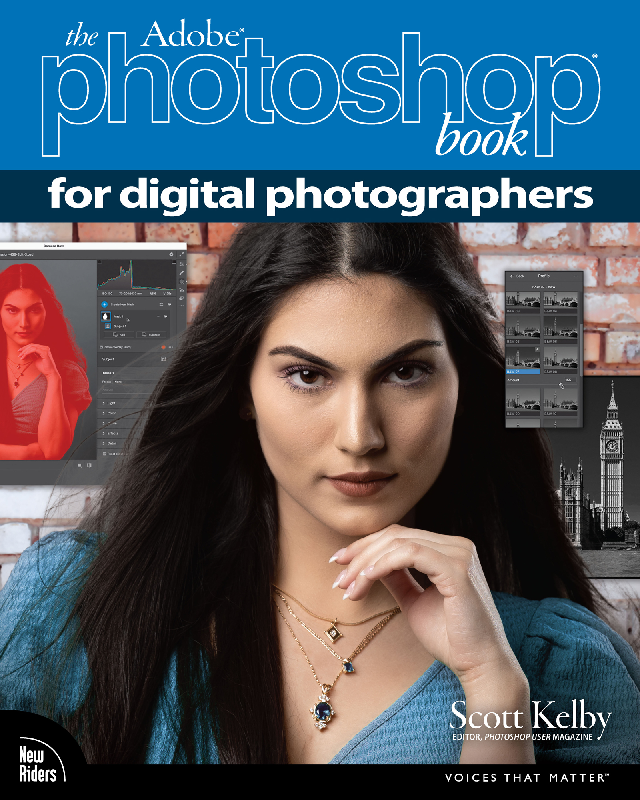
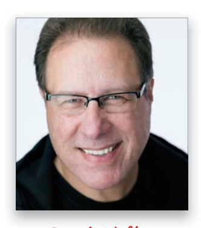
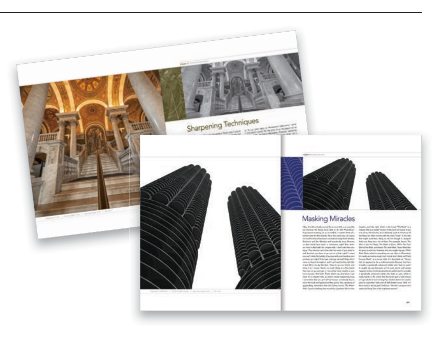
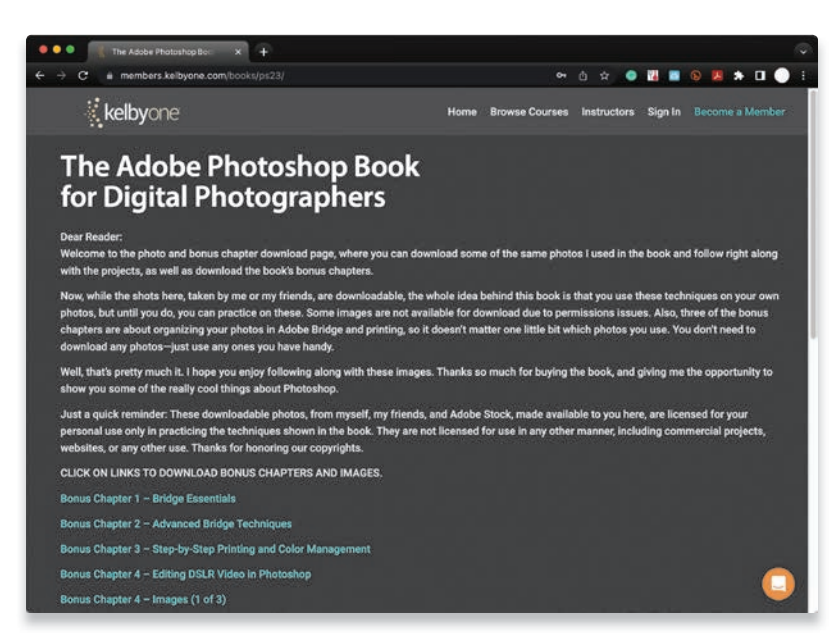
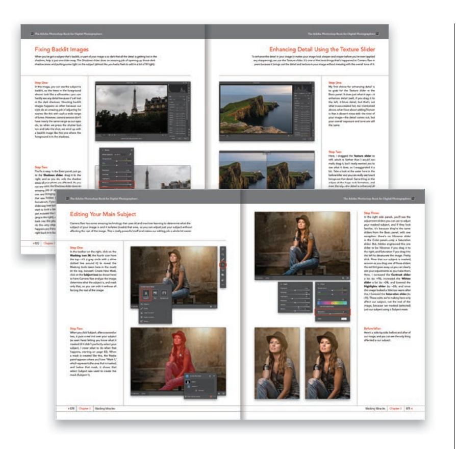
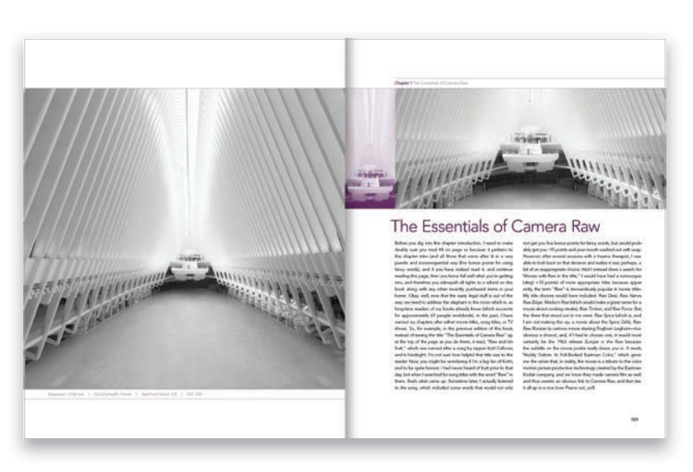
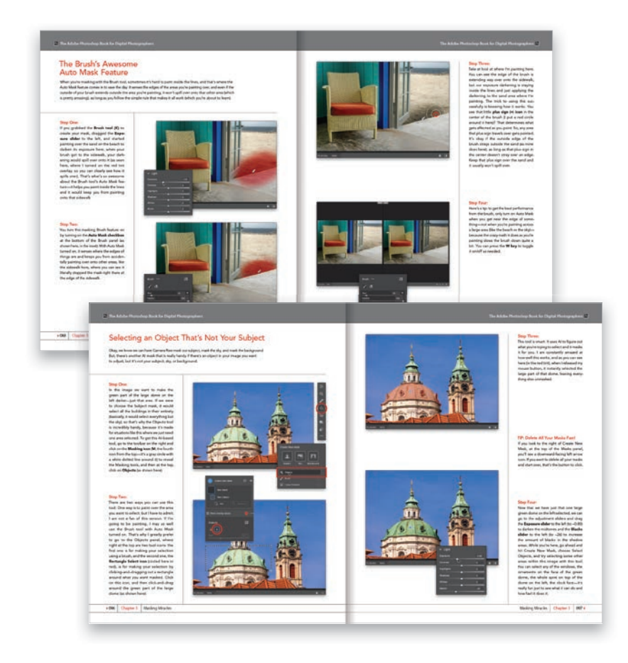
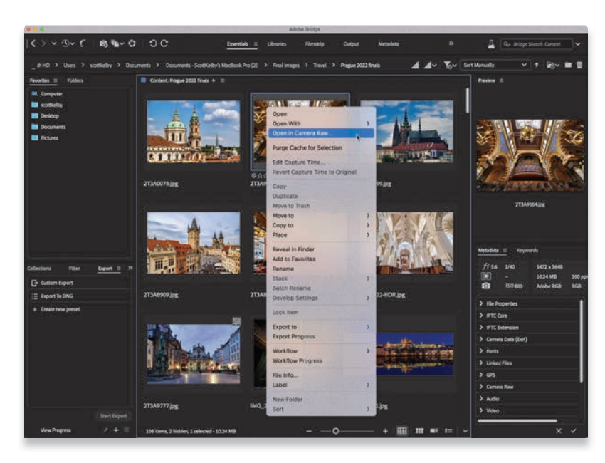
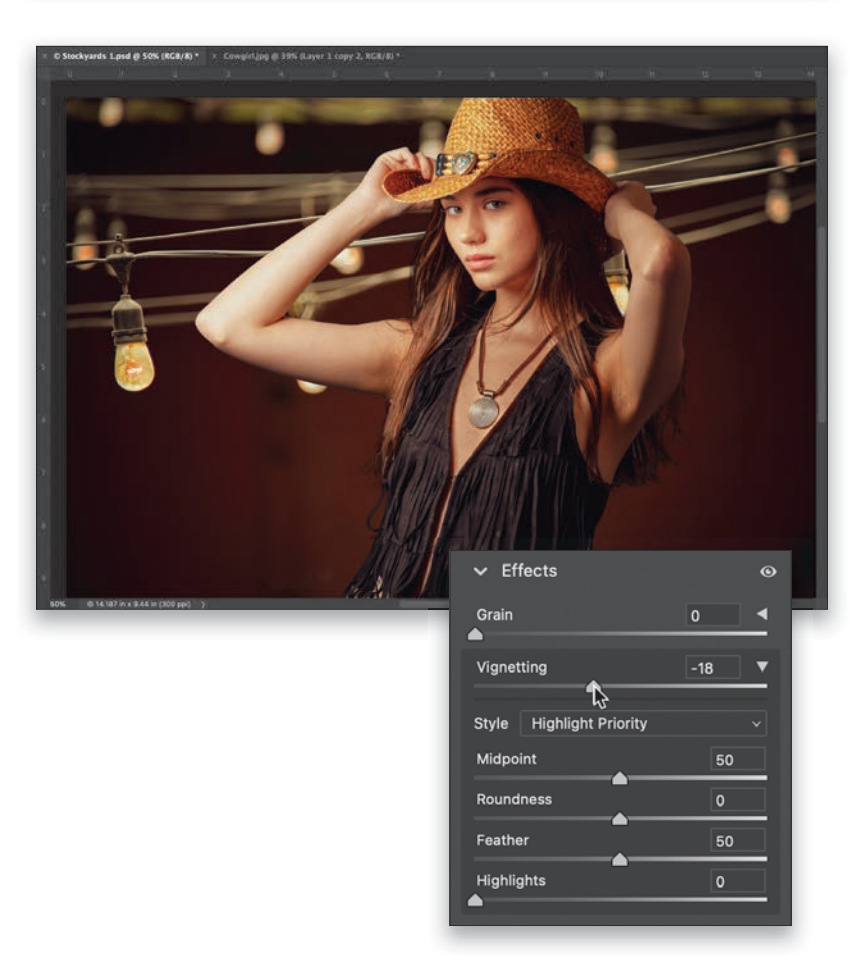

Adobe Photoshop 数码摄影师手册

## 导言

### 致谢

我每写一本新书，都会以同样的方式开始致谢，感谢我了不起的妻子卡莱布拉。 如果你知道她是一个多么了不起的女人，你就会完全理解为什么了。

这听起来很傻，但如果我们一起去买菜，她让我去不同的过道买牛奶，当我拿着牛奶回来时，她看到我从过道走回来，她会给我一个最温暖、最美好的微笑。 这并不是因为我找到了牛奶，她很高兴；每次见到她，我都会露出同样的笑容，即使我们只分开了 60 秒钟。 那笑容就像在说："这就是我爱的人" 如果在 34 年的婚姻生活中（今年 9 月），你每天都能看到几十次这样的微笑，你会觉得自己是世界上最幸运的人，相信我，我真的这么觉得。 直到今天，只要看到她，我的心里就会响起一首歌，让我的心跳加速。 当你经历这样的生活时，你会感到无比幸福和感激，我真的是这样的人。

所以，谢谢你，我的爱人。 感谢您的善意、拥抱、理解、建议、耐心和慷慨，感谢您是一位充满爱心和同情心的母亲和妻子。 我爱你。

其次，要特别感谢我的儿子乔丹。 我的第一本书是在我妻子怀着他的时候写的（26 年多前），
，他简直就是在我的笔下长大的，所以当他几年前完成了他的第一本书（一本 243 页的科幻奇幻小说）时，你可以想象我是多么的自豪。 看着他成长为这样一个优秀的年轻人，我感到非常高兴，他拥有母亲的温柔和慈爱之心，以及超乎年龄的同情心。 当他和他的好妻子 Stephi 一起步入人生的殿堂时，他知道他的父亲不会比他更骄傲，也不会比他更兴奋。 在他的一生中，他以不同的方式感动了许多人，尽管他还很年轻，但已经激励了许多人。 我迫不及待地想看到他的奇妙冒险、爱与欢笑，以及他的人生。 这个世界需要更多的 "你"！
感谢我们的好女儿基拉，感谢她回应了我们的祈祷，感谢她对你哥哥的祝福，感谢她再次证明奇迹每天都在发生。 你是你母亲的小克隆人，相信我，这是我对你最大的褒奖。 能看到这样一个快乐、搞笑、聪明、有创造力、令人敬畏的小天使每天在家里翩翩起舞，真是一种幸福--她不知道她让我们多么开心和自豪。

特别感谢我的大哥杰夫。 在我的生命中，有太多值得感恩的事情，而在我的成长过程中，有你这样一个积极的榜样，是我特别感恩的一件事。 你是任何人都能拥有的最好的兄弟，我已经说过无数次了，但再多说一次也无妨--我爱你，兄弟！

我衷心感谢 KelbyOne 的整个团队。 我知道每个人都认为自己的球队很特别，但这一次我是对的。 能与你们共事，我感到非常自豪，你们日复一日所取得的成就仍让我感到惊讶，你们对所做的每一件事都投入了极大的热情和自豪感，这让我印象深刻。

在此，我要向我的内部编辑金-多蒂（Kim Doty）表示衷心的感谢。 正是她令人惊叹的态度、热情、风度和对细节的关注，让我一直坚持写书。 当你写这样一本书时，有时你真的会觉得自己孤军奋战，但她真的让我觉得我并不孤单--我们是一个团队。 当我遇到困难时，往往是她鼓励的话语或有用的想法让我继续前进，我对她感激不尽。 金，你是 "最棒的！"
同样幸运的是，我的书籍由才华横溢的杰西卡-马尔多纳多设计。 我非常喜欢杰西卡的设计方式，以及她在设计中加入的所有巧妙的小细节。 她不仅才华横溢、合作愉快，还是一位非常聪明的设计师，她设计的每个版面都会超前五步。 当我们找到你时，我们中了大奖！

另外，非常感谢我们的文案编辑辛迪-斯奈德（Cindy Snyder），我很庆幸她还在和我们一起为这些书工作。 谢谢你，辛迪！

感谢我亲爱的朋友和商业伙伴让-A-肯德拉这些年来对我的支持和友谊。 你对我，对 Kalebra，对我们公司都意义重大。

非常感谢我的挚友、"真正的火箭人"、天文专家、特斯拉研究教授、非官方但仍是官方的迪士尼游轮大师、风景摄影旅行者和亚马逊 Prime 发烧友埃里克-库纳先生。 你是我喜欢上班的原因之一。 你总是能发掘出很酷的东西，跳出条条框框，确保我们总是出于正确的原因做正确的事。 感谢您的友谊、辛勤工作和宝贵建议。

感谢克莱伯-斯蒂芬森（Kleber Stephenson）确保了各种令人惊叹的事情发生、大门打开、机会出现。 我特别喜欢我们一起出差，在那里我们笑得太开心，吃得太多，出差的乐趣比之前安排的更多。

向 Peachpit Press 的工作人员和我的编辑劳拉-诺曼（Laura Norman）致敬，感谢她引导我的书安全诞生。

感谢曼尼-斯蒂格曼（Manny Steigman）一直以来对我的信任，感谢他这些年来对我的支持和友谊。 感谢 Gabe 和 B&H Photo 的所有员工。 没错，它是世界上最棒的相机商店，但它的意义远不止于此。

感谢这些朋友，他们与本书无关，却与我的生活息息相关，我只想给他们一个文学版的拥抱：保罗-科贝尔、杰夫-雷维尔、特德-瓦伊特、胡安-阿方索、穆斯-彼得森、拉里-格雷斯、罗布-福尔迪、戴夫-克莱顿、维多利亚-帕夫洛夫、戴夫-威廉姆斯、凯利-琼斯、克里斯蒂娜-绍尔、拉里-贝克尔、彼得-特雷德韦、罗伯托-皮斯康蒂、费尔南多-桑托斯Marvin Derizen、Maxx Hammond、Brad Moore、Joe McNally、Jason Stevens、Annie Cahill、Rick Sammon、Mimo Meidany、Tayloe Harding、Dave Black、John Couch、Greg Rostami、Frank Doorhof、Peter Hurley、Kathy Porupski 和 Vanelli。

我非常感谢 Adobe 的几位杰出人士，包括 Jeff Tranberry、Mala Sharma、Julieanne Kost、Russell Preston Brown 和 Terry White。 离开但未被遗忘Barbara Rice, Rye Livingston, Jim Heiser, Tom Hogarty, Sharad Mangalick, John Loiacono, Kevin Connor, Deb Whitman, Bryan Hughes, Addy Roff, Cari Gushiken, Bryan Lamkin, Karen Gauthier, and Winston Hendrickson.

感谢我的导师们，他们的智慧和鞭策给了我难以估量的帮助，包括约翰-格拉登、杰克-李、戴夫-盖尔斯、朱迪-法默和道格拉斯-普尔。

最重要的是，我要感谢上帝和他的儿子耶稣基督，感谢他带领我找到了我的梦中情人，感谢他赐予我们两个了不起的孩子，感谢他让我以自己真正热爱的事业为生，感谢他在我需要的时候一直在我身边，感谢他赐予我美好、充实和幸福的生活，感谢他赐予我一个温暖、充满爱的家庭与我分享。

### 斯科特-凯尔比的其他书籍

- 面向 Lightroom 用户的 Photoshop

- 旅行摄影书

- Adobe Photoshop Lightroom Classic 电子书

- 快闪手册

- 风光摄影书

- 如何在 Lightroom 中做到这一点？

- 如何在 Photoshop 中做到这一点？

- 自然光摄影书

- 摄影师使用 Photoshop 的专业人像修饰技术

- 数码摄影手册》，第 1、2、3、4 和 5 部分

- 照明、拍摄、修图，第 2 版

- 数码摄影师的 Photoshop Elements 电子书

- 这是一件耶稣的事：献给想成为耶稣的人的书

- 专业体育摄影工作流程

### 关于作者

斯科-凯尔比

斯科特是摄影师在线教育社区 KelbyOne 的总裁兼首席执行官。 他是《_Photoshop User_》杂志的编辑、发行人和联合创始人；极具影响力的摄影师每周现场脱口秀节目《The Grid》的主持人；以及一年一度的斯科特-凯尔比全球摄影行活动的创始人。
斯科特是一名摄影师、设计师和获奖作家，著有 100 多本书，其中包括Photoshop for Lightroom Users》、《The Flash Book》、《The Adobe Photoshop Lightroom Book》、《Photoshop 摄影师的专业人像修饰技术》、《The Landscape Photography Book》、《Light It, Shoot It, Retouch It》、《_The Travel_ Photography Book》、《How Do I Do That In Lightroom?

他的著作已被翻译成数十种不同语言，包括中文、俄文、西班牙文、韩文、波兰文、台湾文、法文、德文、意大利文、日文、希伯来文、荷兰文、瑞典文、土耳其文和葡萄牙文等。 他还获得了著名的 ASP 国际奖，该奖由美国摄影师协会每年颁发一次，表彰
"…以特殊或重要的方式对作为艺术和科学的专业摄影理想做出的贡献"，以及 HIPA 奖，表彰他对全球摄影教育做出的贡献。

斯科特是 Photoshop 世界年会的会议技术主席，并经常在世界各地的会议和贸易展览会上发表演讲。 他是 KelbyOne.com 一系列在线学习课程的主讲人，自 1993 年以来一直从事摄影师和 Photoshop 用户的培训工作。

有关斯科特的更多信息，请访问他的网站：

- 他的 Light room 日常博客：lightroomkillertips.com
- 他的个人博客：scottkelby.com
- Twıer：@scottkelby
- Facebook: facebook.com/skelby
- Instagram：@scottkelby
- LinkedIn: scottkelby

### 你会希望在读这本书之前就知道的七件事

对我来说，最重要的是你能从阅读这本书中获得很多东西，而我能帮你的一个方法就是让你读一读关于这本书的这七件事，你会希望以后你现在就知道了。 例如，我在这里告诉你在哪里可以下载我在书中使用的图片，这样你就可以用它们进行练习。如果你跳过这一点，最终你会给我发电子邮件询问图片在哪里，但到那时你就会非常委屈，而且…，情况会变得很糟糕。 如果您现在花两分钟时间阅读这七件简单的事情，我们就可以跳过这一切（以及更多）。 我保证让你不虚此行。

#### 1: 您不必按顺序阅读本书。

我设计这本书的目的是让你可以直接翻到你想学的技术，并从那里开始。 如果你想学习如何去除图像上的灰尘斑点，只需翻到第 46 页，一两分钟后你就会知道了。 我确实按照学习 Photoshop 的逻辑顺序编写了这本书，但不要因此而束手束脚。 直接跳到你想学的技术--你可以随时回头复习，尝试其他东西。

#### 2: 跟着我在书中使用的许多相同照片练习。

当你翻阅这本书时，当你看到 "创建全景 "这样的技巧时，你可能没有一组全景照片，所以在这种情况下，我通常会提供图片供你下载，这样你就可以跟着这本书学习了。 您可以在 http://kelbyone.com/books/ps23 上找到它们（看，这就是我刚才说的，如果您跳过这一章直接看第 1 章就会错过的东西之一）。

#### 3: 即使你不使用 RAW 格式拍摄，也会经常使用 Camera Raw。

随着时间的推移，摄影师在 Photoshop 中的工作流程也发生了很大的变化，因此您会在 Photoshop 的 Adobe Camera Raw 部分中完成很多工作。 别担心，使用 Camera Raw 不一定要使用 RAW 格式拍摄。 它可以很好地处理 JPEG 或 TIFF 文件。 其中一个重要原因是，Adobe 已将 Photoshop 的大部分新摄影功能添加到 Camera Raw 中，这些功能只存在于 Camera Raw 中，包括改变游戏规则的全新 AI 蒙版功能，而当今 Photoshop 中的大部分摄影工作流程都是基于 Camera Raw。

我希望你们事先了解这一点，因为我们在整个过程中会经常使用 Camera Raw，无论是在开始阶段，还是将其作为滤镜使用。 它是现代工作流程的重要组成部分，而且正如我所说，使用 Camera Raw 绝对不一定要使用 RAW 格式拍摄，JPEG 格式也能很好地胜任。

#### 4: 警告：章节介绍页面非常糟糕！

在一般的书中，每章开头的介绍页都会让你对接下来的章节有一些重要的了解。 但是，我的真的没有。 这些简短、古怪、漫无边际的引言与该章节的实际内容几乎没有关系。

这些设计只是为了让你在章节之间有一个 "精神休息" 的时间，它们已经成为我所有书中的传统。 很多人都喜欢它们（以至于我们出版了一整本书，除了这些章节的引言，什么都没有。

但有些 "正经人 "对它们恨之入骨，就像一千个燃烧的太阳，所以我现在警告你，以防你也是那些正经人中的一员，讨厌这样的东西。 如果这听起来像你的想法，我求求你，请完全跳过章节介绍，因为这本书的其余部分真的很简单明了。

#### 5：Photoshop 和 Camera Raw 中有一些功能可以做完全相同的事情。

例如，Camera Raw 的光学面板中有镜头修正功能，Photoshop 中也有镜头修正滤镜。 在我自己的工作流程中，如果可以在 Camera Raw 和 Photoshop 中完成完全相同的任务，我总是选择在 Camera Raw 中完成，因为：(a) 它更快（在 Camera Raw 中没有进度条，一切都是实时发生的）；(b) 它是非破坏性的（所以你可以随时改变我的想法）；(c) 如果你用 RAW 格式拍摄，它会将编辑应用于 RAW 16 位图像，而 RAW 16 位图像的色调范围更广，即使大量编辑也不会对图像造成明显的损害。 因此，如果我在 Camera Raw 中向你展示的东西也可以在 Photoshop 中完成，我可能会提到它，但我只会在 Camera Raw 中展示（因为我就是这样做的）。

#### 6: Adobe Bridge 东西在哪里？

Adobe 在 Bridge 方面已经有很多年没有大动作了。 我不想说它被遗弃了，但还有点。 我认为 "桥 "的前景并不光明，而且它多年来一直没有什么变化（它的速度比一只浑身涂满糖浆的哮喘三趾树懒在沙丘上上坡还要慢），因此我不再将它列入本书。 但是，如果你是 Photoshop 的新手，你不使用 Lightroom，而且你认为你可能需要 Bridge（请重新考虑一下），我确实写了整整两章关于 Bridge 的内容，并把它们放在本书的下载页面上供你免费下载。 您可以在 http://kelbyone.com/books/ps23 找到这些内容，以及另外两个关于打印和编辑视频的额外章节（看，我很关心）。

#### 7：真的没有第七件事…

…但说 "六件事...... "不会让任何人读到任何东西。 七是一个神奇的数字（尤其是在介绍书籍的时候），所以我希望你们能原谅我夸大了重要事情的数量。

好了，你可以开始工作了。 是时候释放 Photoshop 的神奇魔力了。 让我们开始吧！

