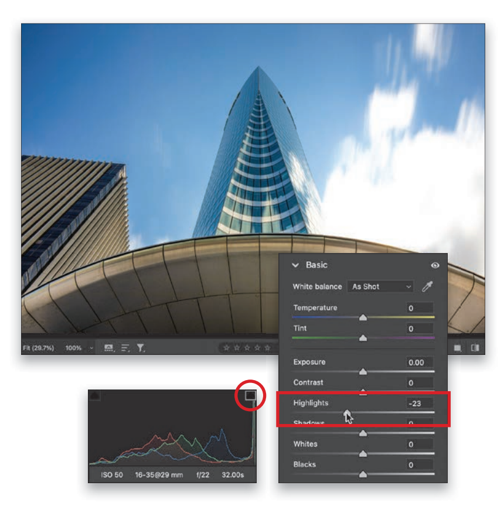

## 第 1 章：Camera Raw 的基本要素

在你深入阅读本章引言之前，我需要加倍确保你阅读了第 xvii 页的\#4，因为它与本章引言（以及其后的所有引言）有关，而且是以一种非常苍白无力和无足轻重的方式（使用华丽词藻加 5 分），如果你确实阅读了它，并且继续阅读这一页，那么你就完全知道你正在进入什么境地，因此你放弃了对这本书以及你家最近购买的其他物品进行退款的所有权利。 好了，既然讨厌的法律问题已经解决了，我们需要解决房间里的大象问题，那就是，我的书的长期读者已经知道（占全球约 61 人），过去，我用电影名、歌曲名或电视节目名来命名我的章节。 因此，举例来说，在本书的上一版中，你看到的标题不是 "The Essentials of Camera Raw"，而是 "Raw and UnKutt"，这是以说唱歌手 Kutt Calhoun 的一首歌命名的。 现在，你可能想知道我是不是 Kutt 的忠实粉丝，老实说，在那天之前我从未听说过 Kutt，但当我搜索带有 "Raw" 字样的歌名时，出现的就是它。 后来，我真的听了这首歌，其中的一些词不仅不会让你得到 5 分的花言巧语奖励，而且很可能会让你得到-15 分，并用肥皂洗掉你的嘴。

然而，在与创伤治疗师进行了几次治疗后，我回过头来看这个决定，意识到这也许是一个有点不恰当的选择。 如果我搜索的是 "片名中包含'Raw'的电影"，我就会看到一大堆（叮！ +10 分）更合适的标题，因为显然 "Raw" 一词在电影标题中非常流行。

我选择的标题包括《原始交易》（Raw Deal）、《原始神经》（Raw Nerve）、《原始边缘》（Raw Edge）、《中度原始》（Medium Raw）（这个名字很适合用来拍摄一部关于烹饪牛排的电影）、《原始木材》（Raw Timber）和《原始力量》（Raw Force）。 但是，让我印象最深刻的有三部：Raw Spice》（这不是我编造的，是一部关于辣妹的电影）、《Raw Raw Rooster》（一部由 Foghorn Leghorn 主演的卡通电影--太明显的选择了），如果非要选一部的话，那肯定是 1963 年上映的《Europe in the Raw》，因为电影海报上的副标题真的很吸引人。 上面写着："裸露无处不在：这给我的感觉是，这部电影实际上是向伊士曼柯达公司创造的彩色电影制作技术致敬，而我们知道他们也制作摄影胶片，因此与《Camera Raw》建立了明显的联系，这就为影片画上了一个完美的句号。 安静下来，你们。

### 如何在 Camera Raw 中打开 Jpeg、Tiffs 和原始图像

虽然 Adobe Camera Raw 最初是用于编辑相机 RAW 格式的照片，但你也可以用它来编辑 JPEG 和 TIFF 照片。 很多人没有意识到使用 Camera Raw 的一大优势，那就是使用 Camera Raw 比其他任何方法都更容易、更快地使图像美观。 Camera Raw的控件非常简单，它们是即时的，完全可以撤消，这使得它很难被击败。 但首先，让我们看看如何在 Camera Raw 中打开图像。

#### 打开 Raw 图像

由于 Camera Raw 是专为打开 RAW 图像而设计的，因此只要双击 RAW 图像（无论是在 Bridge 中还是在计算机上的文件夹中），就会启动 Photoshop（如果还没有打开的话），并在 Camera Raw 中打开该 RAW 图像（其官方全称是 Adobe Camera Raw，但在本书中，我只是简称它为 "Camera Raw"，因为…well…我就是这么称呼它的）。 _注：_ 如果你双击明知是 RAW 格式的图像，却无法在 Camera Raw 中打开，请确保你使用的是最新版本的 Camera Raw--新发布相机的图像需要最新版本的 Camera Raw 才能识别其 RAW 文件。

#### 从 Adobe Bridge 打开 Jpeg 和 Tiff 图像：

如果想从 Adobe Bridge 打开 JPEG 或 TIFF 图像，方法很简单：点击图像并按 Command-R（PC：Ctrl-R），或者右键单击图像，从弹出菜单中选择 **在 Camera Raw 中打开**（如图所示）。

#### 直接从电脑打开 Jpeg 和 Tiff 图像：

如果您想直接从电脑打开 JPEG 或 TIFF 图像，请按以下步骤操作：在 Mac 上，进入 Photoshop 的 "文件 "菜单，选择 "**打开**"。 当 Open 对话框出现时，单击您的 JPEG（或 TIFF，但我们将使用 JPEG 作为示例）图像，您将看到 Format 弹出菜单设置为 JPEG。 点击并按住弹出菜单，然后选择 **Camera** Raw（如图所示）。 现在，点击 "打开" 按钮，JPEG 图像就会在 Camera Raw 中打开。 在 Windows 电脑上，过程类似，但 Windows 版本中没有 Photoshop 菜单，因此您需要转到 "File" 菜单，然后选择 "Open As"。 单击 JPEG，将右下角的弹出菜单更改为 **Camera Raw**，然后单击 "打开"。

#### 打开多个图像

你可以在 Camera Raw 中打开多张 RAW 照片，方法是先选择它们（在 Bridge 中或电脑上的文件夹中），然后双击其中任何一张，它们就会全部在 Camera Raw 中打开，并在窗口底部显示为胶片条（如图所示）。 如果照片是 JPEG 或 TIFF，在 Bridge 中先选择它们，然后按**Command-R（PC：Ctrl-R**）。 您无法从 Mac Finder 或 Windows Explorer 窗口打开多个 JPEG 或 TIFF 文件；您需要使用 Bridge 打开它们（只需使用 Bridge 中的路径栏导航到这些图像所在的位置）。

#### 在 Camera Raw 中编辑 Jpeg 和 Tiff 图像：

关于在 Camera Raw 中编辑 JPEG 和 TIFF 的一件事：当你对 JPEG 或 TIFF 文件进行调整并单击 "打开" 按钮时，图像会在 Photoshop 中打开（如你所料）。

不过，如果你只想保存在 Camera Raw 中做出的更改，而不想在 Photoshop 中打开照片，那么请单击**完成按钮**（如图所示），你的更改就会被保存下来。 但编辑 JPEG 或 TIFF 图像与编辑 RAW 图像有很大区别。 如果点击 "完成" 按钮，实际上就会影响原始 JPEG 或 TIFF 文件的真实像素，而如果是 RAW 图像，就不会这样（这是使用 RAW 拍摄的另一大优势）。 如果单击 "打开" 按钮，并在 Photoshop 中打开 JPEG 或 TIFF 文件，则也是在打开和编辑真实图像。 你知道的。

#### 两个 Camera Raw

还有一件事你需要知道：Photoshop 中实际上有两个 "Camera Raw"，一个在 Photoshop 中，另一个在 Adobe Bridge 中（你会注意到 Bridge 的 "Camera Raw "有一个较暗的 "色彩主题"）。

当你处理（或保存）大量 RAW 照片时，拥有两个 Camera Raw 的优势就显现出来了--当你在 Photoshop 中处理其他照片时，你可以在 Bridge 的 Camera Raw 中处理这些照片。 如果你经常使用 Bridge 的 Camera Raw，那么你可能需要按 Command-K（PC：Ctrl-K）调出 Bridge 的首选项，点击左侧的 "常规"，然后打开 **DoubleClick Edits Camera Raw Settings in Bridge** 复选框（如图所示）。 现在，双击照片可在 Bridge 的 Camera Raw 而不是 Photoshop 中打开 RAW 照片。

### 如果您使用 Raw 格式拍摄，请从这里开始

大多数无反相机和数码单反相机都有一个名为 "图片风格"（或创意风格或图片控制，取决于您的相机品牌）的功能，它允许您通过增强色彩、对比度和其他东西来 "提升" 照片，以获得更好的拍摄效果。

例如，如果您拍摄的是风景场景，您可以在相机中应用 "风景" 图片样式，这样您的图像看起来会更加绚丽多彩，对比度更高。 如果您要拍摄肖像，还有一种肖像图片风格，可以让您的照片看起来更平整、更美观。 问题是，如果您使用 RAW 格式拍摄，Camera Raw 会忽略您在相机中选择的任何图片样式。 幸运的是，你可以在 Camera Raw 中对 RAW 图像一开始就应用类似的样式，这与 Adobe Color 的标准默认外观相比，可以为你的编辑提供更好的起点。

#### 第一步

在我们开始讨论之前，请注意：这只适用于在相机上以 RAW 格式拍摄的情况。 如果您使用 JPEG 或 TIFF 格式拍摄，则可以完全跳过此选项，因为它只适用于 RAW 图像。

在 "Camera Raw" 中，如果你抬头看看右侧编辑面板的顶部，在 "Profile/配置文件" 字样的右侧，你会看到 "Adobe 颜色/Adobe Color" 被选中（如图所示）。

这是 RAW 图像的默认设置。 现在，问问你自己"默认的东西是否意味着'踢屁股'？" 不，没有。 这就是我不使用 Adobe Color 的原因。 "还行"。 就是不怎么样。

我认为编辑 RAW 图像有更好的起点，因此找到更好的 RAW 配置文件是我编辑过程的第一步。

#### 第二步

无论是否编辑风景照片，我一般 "常用" 的 RAW 配置文件都是 "Adobe 风景/Adobe Landscape"。 我觉得它几乎能给所有图像带来最佳的整体效果，但人像除外（如果要编辑人像，我会选择 "Adobe 人像/Adobe Portrait"，这是一种针对肤色进行调整的配置文件，肤色区域的饱和度和对比度都较低）。 您可以在此处看到颜色和对比度是如何增加的，我从 "配置文件/Profile" 弹出菜单中选择了 **"Adobe 风景/Adobe Landscape"**。 如果您只需点击一下，就能以更好的方式开始编辑工作，您为什么不这样做呢？

#### 第三步

还有一种方法可以考虑，那就是不使用 Adobe 的 RAW 配置文件，而是使用一套基于特定品牌相机（佳能、尼康、索尼）图片风格配置文件的 "相机匹配配置文件"。 要查看这些配置文件，请单击 "配置文件/Profile" 弹出菜单右侧带有三个小矩形和一个放大镜的图标，打开 "配置文件/Profile" 浏览器，然后向下滚动并单击 "**相机匹配/Camera Matching**"，一组缩略图就会出现。 要查看这些配置文件在图像上的效果，只需将光标停留在缩略图上即可。 如果您找到喜欢的图片，请点击它（在这里，我点击了 "Landscape v2"，这张图片看起来非常不错）。

#### 第四步

下面是只做了一处改动的前后对比：我选择了 Camera Matching Landscape v2 配置文件（如第三步所示）。 因此，如果你想让 Camera Raw 给你一个类似的外观作为起点（外观更像你在相机背面看到的 JPEG 预览），不妨试试这个方法。 如果你发现自己经常使用某个特定的配置文件，可以将其添加到配置文件弹出菜单和收藏集，这样就可以随时一键使用。 要做到这一点，请将光标移动到您在 “Profile 浏览器” 中想要的 Profile 资料的缩略图上，然后在右上角出现**星形图标**。 点击后，它就会出现在个人资料浏览器顶部的收藏夹和个人资料弹出菜单中。 还有一件事：当你查看 "相机匹配" 设置时，如果你的选择看起来和我的不一样，那只能说明你使用了不同品牌的相机，所以你也许应该卖掉你的相机，买一台和我用的一样的相机。 当然，我是在开玩笑。

嗯，有点。 ;-)

### 在编辑过程中随时使用 Camera Raw

我们说过要从一开始就在 Camera Raw 中打开图像（我强烈推荐这样做，无论是 RAW、JPEG 还是 TIFF 图像），但如果你已经这样做了呢：在 Camera Raw 中打开图像，点击 "打开"，它现在就在 Photoshop 中打开了。 你在 Photoshop 中工作，但你想使用一两项只有在 Camera Raw 中才能找到的功能？ 现在还来得及吗？ 没问题。 你可以随时在 Photoshop 中重新打开 Camera Raw 来编辑图像，其中约 97% 的功能都可用（有一些功能不在滤镜中，如白平衡预设、RAW 配置文件和裁剪工具），但你想做的事情可能都还在。

#### 第一步

在 Photoshop 中打开图像后，如果想在 Camera Raw 中进行编辑，只需在滤镜菜单下选择**Camera Raw** Filter （如图所示）即可。

#### 第二步

Camera Raw 窗口将打开，现在您可以进行所需的任何更改。 完成后，只需单击“确定”按钮（替换“完成”和“打开”按钮），即可返回 Photoshop 并应用了 Camera Raw 更改。 提醒一下：如果你的图像已经在 Photoshop 中打开，即使它是在相机上以 RAW 格式拍摄的，此时也不再是 RAW 照片，所以它不会返回并重新打开 RAW 版本，而是取走你已经在 Photoshop 中打开的 8 位或 16 位照片，然后在 Camera Raw 中打开。 这并不是什么坏事，而且也能正常工作，但我还是想让你们知道一下，以防你们有疑惑。

### 设置图像白平衡的三种方法

这是使颜色正确的关键部分，因为如果颜色不正确，…，那就是错误的。 理想情况下，我们会在相机中调整好白平衡（根据拍摄时的光线条件选择合适的白平衡），但如果您使用自动白平衡（这是最常用的设置）拍摄，而您的色彩出现偏差，以下是修复方法。

在我的工作流程中，白平衡通常是我首先要调整的，因为正确的白平衡可以消除 99% 的色彩问题。 在编辑过程中，我会在曝光之前尽早进行白平衡调整，因为如果稍后更改白平衡，就会改变整体曝光。

#### 原始图像：

在基本面板的顶部（Camera Raw 窗口的右侧），你可以找到白平衡控件。

你会看到一个白平衡弹出菜单，默认情况下，它显示的是**拍摄时**的白平衡（如图所示；你看到的是拍摄时在相机中设置的白平衡）。 我一直在室内的普通照明下拍摄，所以白平衡设置为钨丝灯，但天亮后我到室外拍摄，忘记了更改白平衡，所以前几张照片拍出来是蓝色的。 让我们来看看改变白平衡的三种简单方法。

#### 方法一

第一种方法是选择内置的白平衡预设--通常这就是你所需要的全部。 只需点击**白平衡弹出菜单**，你就会看到一个可以在相机中选择的设置列表。 选择与拍摄照片时的光线环境最匹配的预设（例如，如果在树下拍摄，则选择阴影预设）。 在这里，我尝试了每种预设，**阴天**似乎看起来最好。 (注：这是编辑 RAW
图像与编辑 JPEG 或 TIFF 图像的不同之处。 只有使用 RAW 图像时，你才能获得这份完整的白平衡预设列表。 对于 JPEG 或 TIFF 文件，您只能选择 "如拍摄 "或 "自动白平衡"）。

#### 方法二

这是我最喜欢的方法，就是使用**白平衡工具**（白平衡弹出菜单右侧的滴管）。 单击它，然后单击图片中应该是中性色的东西--最好是浅灰色，但如果不是，也可以是中性色，比如棕褐色、米色或任何灰色。 在这里，我点击了其中一个缆车上的深灰色区域，效果相当不错（看看右边的建筑物，你会发现这个白平衡比阴天预设要暖一些）。 用滴管不断点击不同的区域，你会发现这对白平衡有什么影响。

通常只需点击几下，就能找到你喜欢的白平衡效果。

#### 方法二（续）：

这是使用白平衡工具前后的对比照片，你可以看到设置正确的白平衡会带来多么大的变化。 顺便说一下，按键盘上的**P 键**来打开/关闭预览功能，就能快速查看白平衡编辑前后的效果。

#### 方法三

如果你想在白平衡上发挥创意（我在这张照片中切换了图像），那么我建议你使用色温和色调滑块（它们就在白平衡弹出菜单的右下方）。 这些滑块后面的条形图是用颜色编码的，因此你可以看到拖动哪个方向可以获得哪种色调。 在这里，我将**色调滑块**向右拖动，然后将**色温滑块**也向右拖动，以获得日落的白平衡效果。 当然，这与我在那里时的样子并不准确（左边的照片更像当时的样子）--这完全是一种创意选择。 我使用这些滑块的另一个目的是在试图获得准确的白平衡时调整预设。

例如，如果你一开始应用的是内置白平衡预设，但觉得有点太蓝，你可以将温度滑块向黄色方向拖动，远离蓝色，以达到平衡。色温 _提示：_ 您可以直接双击滑块上的小 "凸点" 来重置滑块，这样就能将其重置为默认值。 此外，要将白平衡重置为打开图像时的状态，只需直接双击白平衡工具（滴管图标）即可。

### 在 Camera Raw 中查看之前/之后的效果

能够在编辑过程中随时查看“之前”图像非常有用，但能够在 Camera Raw 中并排查看前后视图确实会让事情更上一层楼。 您不仅可以轻松查看快速的并排视图，而且还有令人惊喜的大量选项，让您可以按照自己的喜好获得前后视图。

#### 第一步

如果您进行了一些调整，并想查看调整前的图像（"之前"图像），只需按下键盘上的 **P 键**即可。 要返回 "之后" 图像，请再按一次 P。 如果您想查看并排的 Before/After 视图（就像您在这里看到的那样），请单击预览右下角下方的 **Before/After** 视图图标，或者只需按 Q 键即可获得您在此处看到的视图，其中 Before 图像位于左侧，After 图像位于您应用的调整中。 在右侧（在这里，我调整了白平衡，稍微降低了自然饱和度，并稍微减少了高光）。 _注意：_ 每次按 Q 键时，它都会切换到不同的 Before/After 视图。

#### 第二步

这种并排视图对于高大的垂直图像效果很好，但对于像这样的宽方向图像，预览效果就显得相当小了。 幸运的是，你可以解决这个问题：
进入该视图后，只需按下**Command-+**（加号；**PC：Ctrl-+**），就可以像这里一样放大图片。 每按一次快捷键，它就会放大得更小。 放大后，只需单击任一图像（光标变为手形工具），然后任意拖动图像，即可调整图像的位置。 要缩小，请按**Command- -**（减号；**PC：Ctrl--**），直到放大到足够大为止。

#### 第三步

另一个预览选项是分屏预览，将图像的左半部分显示为 "之前"，右半部分显示为 "之后"（如图所示）。 进入该视图后，您可以交换两边，这样 "之后 "就在左边，而 "之前 "就在右边（这样就不是 "之前/之后"，而是 "之后/之前 "了）。 要做到这一点，点击预览右下角 "前后视图 "图标右侧的图标（两个箭头），就可以将两者互换。 如果点击右边的下一个图标，就会将当前设置复制到 "前一幅图像 "中。 最后一个图标（在最右边）可以让你切换当前面板中的更改（就像 Camera Raw 中预览的老方法）。

顺便说一下，如果你点击并按住 "前后视图 "图标（第一个图标），就会出现一个弹出式菜单（如图所示），让你按名称选择不同的前后预览。

#### 第四步

如果再按一次 Q 键，就会切换到 "之前/之后" 的 "顶部/底部" 预览（如图所示，这看起来有点吓人，因为她 "之前" 的头从 "之后" 的头上长了出来）。 如果最后按一次 Q 键，就会出现上下分屏视图。 总之，除了这些之外，你还可以通过进入第三步中的弹出式菜单，选择 "预览首选项"，弹出下面的对话框，从而合理地控制这些内容的显示方式。 第一栏允许你隐藏（通过关闭）任何你不关心的预览复选框（我使用左/右并排视图和分割视图）。 在第二列中，您可以选择是否要在您的之前/之后预览之间看到实线分隔线，并且如果您想在屏幕上看到“之前”和“之后”这两个词。

### 让 Camera Raw 自动修正照片

多年来，我一直警告摄影师不要按下相机原始文件的"自动"按钮，因为它的表现相当糟糕。

我们过去常开玩笑说它是"过曝我的照片"按钮，因为如果你点击它，通常就是这样做的。

但是如今，“自动”按钮实际上相当不错，如果没有别的话，它可以帮助您找到一个不错的起点。

#### 第一步

您可以让 Camera Raw 分析图像，并通过单击“自动”按钮（此处以红色圆圈显示）自动为您设置整体曝光度。

在许多情况下，它做得相当不错。 至少，它能为你提供一个编辑图像的合理起点，而且我发现，图像看起来越糟糕，效果就越好。

如果没有达到要求，可能是因为：(1) 阴影太明显，有时会出现这种情况（尤其是在拍摄人像时，你会注意到这一点），如果是这种情况，只需将阴影滑块向左拖动，直到看起来恢复自然；或者 (2) 曝光量增加太多，因此照片看起来太亮。 问题简单易解：只需将曝光滑块向左拖动，直到曝光看起来适当为止。

#### **第二步：**

这是我点击**自动按钮**后的同一图像，你可以看到，它看起来好多了。 这并不完美。 这不是“精准无误”，但它是一个相当不错的起点，供您进一步微调（尽管偶尔确实能做到，而您也就完成了）. 使用“自动”按钮，您不会有任何损失。 如果点击后发现效果不佳，也不用担心，只需按**Command-Z**（电脑：Ctrl-Z）即可撤销。 不会造成任何损害。

#### 第三步

自动按钮无法纠正的一大问题是白平衡，这很奇怪，因为有一种自动方法可以让它为你分析和设置白平衡。 只需按住 Shift 键，然后直接双击**色温滑块**，再双击色调滑块（如图所示）即可自动设置白平衡。 顺便看看其他滑块。 请注意它们前面都加了"Auto"一词？

这只有在按住 Shift 键时才会发生。 没错，每个滑块都有自己的自动控制功能。 要使用其中任何一个调整，按住 Shift 键的同时，直接点击调整名称（自动曝光、自动对比度、自动高光等），它就会只对这一个控制进行重新分析。

#### 第四步

让我们继续尝试所有这些自动控制功能。 在第二步中，我们已经进行了整体自动修正，因此这些滑块可能不会移动太多，但会重新分析并根据需要进行调整。 所以，继续按住**Shift键**，然后单击所有调整名称前带有"**自动**"的选项。 如果单击其中一个，但不喜欢结果，只需按**Command-Z**（PC：Ctrl-Z），就可以只撤销这一个自动修正。 下面是图片的完整前后对比，展示了我们所做的三件事：

(1) 我们点击了 "自动" 按钮。

(2) 我们使用了 "Shift-自动白平衡" 功能。

(3) 我们按住Shift键点击了所有滑块，让它们重新分析自动校正。

通常我只需要做第一步——点击“自动”按钮——如果看起来正常，我就把它作为起点。 但是，我想向您展示 （2） 和 （3），以便您知道它们的存在，以及它们如何提供帮助。

### 设置整体曝光，第一部分：扩大色调范围

我使用这种技术作为三管齐下曝光程序的一部分，首先是设置白点和黑点。

这很重要，因为通过这样做（使图像中最明亮的部分尽可能亮，而不过曝，并使最暗的部分尽可能暗，而不死黑），您扩展了图像的色调范围 - 一直以来，Photoshop 用户一直在使用 Photoshop 的级别功能做这些。 现在，我们可以在 Camera Raw 中使用白色和黑色滑块来实现这一功能，更好的是，我们可以让 Camera Raw 自动为我们实现这一功能。

#### 第一步

这是原始图像，你可以看到它看起来非常平淡。 我们以刚才的自动调色教程为基础，让 Camera Raw 为我们进行两项自动设置。 这是我如何为几乎所有图像设置曝光的第一部分。

#### 第二步

首先按住 **Shift** 键。 按住该键后，设置白点和黑点就很容易了。 首先，只需直接点击 "**自动白化**" 字样，它就会在不对所有通道过曝的情况下，尽可能地设置白化亮度（因此，在某些情况下，它可能会对红色通道或绿色或蓝色通道产生过曝，但通常不会对所有三个通道都产生过曝，所以效果非常好）。 您可以在这里看到，它使这张照片的明亮区域更明亮，但并没有过度。

#### 第三步

按住 **Shift 键**，点击 "**自动黑点**"，它就会在不死黑的情况下尽可能地设置黑点。 所以，你只是在不过曝的情况下尽可能使图像最亮的部分变亮，这样就不会出现纯白的情况，而你也尽可能使最暗的部分变黑，不会出现死黑的情况。 这样既能保留高光和阴影中的细节，又能扩大图像的色调范围，你可以看到这里的效果看起来更好。 我们还没有完成（所以下一页还有第二部分），但我们已经为成功做好了准备，因为最后一部分更加容易。

#### 第四步

虽然我们只是让 Camera Raw 自动完成这项操作，但也可以通过按住 **Option**（PC：Alt）键并拖动白色或黑色滑块来手动完成。 使用**白色滑块**时，图像会变成黑色（如顶部所示）。 向右拖动时，单个通道中开始剪切的任何区域（不重要）都开始显示为该颜色。 因此，如果你只是剪切了红色通道，你会看到红色区域出现（如图所示），如果是黄色或蓝色，你只是剪切了这些通道。 大多数情况下，我都不会去管它，但如果我看到有区域开始出现白色（三个通道都在削波），我就会去管它。 啊！），我知道我做得太过分了，于是我把它往左退了一点。 如果按住 Option 键并拖动 **"黑色滑块"**，情况就会相反。 图像会变成纯白色（如底部所示），当你向左拖动 "黑色" 滑块时，任何开始剪切的区域都会显示为剪切通道的颜色，如果所有通道都发生剪切，则显示为黑色。 这就是手动操作的方法，但老实说，我从来不这么做，我在第二步和第三步中使用的是自动操作方法。

### 设置整体曝光，第二部分：设置整体亮度

在设置了白点和黑点之后，我们现在要对整体曝光做出创造性的决定。 看看图片，问问自己："照片的整体亮度看起来是太亮、太暗，还是差不多？ 没有一个国际委员会规定 _你的_ 照片的正确曝光度是多少。 这是摄影师自己的决定。 有些人（就像我）喜欢他们的曝光稍微暗一些，有些人喜欢它亮一点——这是一种"咸淡随口味"的事情。 但是，如果你觉得完全不合适，我们可以使用曝光滑块调整整体亮度。 此时，通常只需稍作调整--将它移到一个方向或另一个方向，使中间色调更亮或更暗一些。

#### 第一步

在这张照片中，你可以看到我在拍摄时曝光不足了很多（这已经是仁慈的表现了）。 因此，我们将采取我的三管齐下的整体曝光措施，让这张照片快速变得更好看。

#### 第二步

我们要做的第一件事就是设置白点和黑点，方法是按住 **Shift 键**，然后点击 "**自动白点**" 字样，再点击
"**自动黑点**" 字样（这些字样只有在按住 Shift 键时才会出现，这在两部分曝光动作的第一部分中提到过）。 你可以看到，只需这样做，扩大图像的色调范围（让 Camera Raw 为我们完成大部分工作），它就能完成相当不错的工作。 现在是评估整体亮度的时候了。 你看了之后可能会想："我不知道，我觉得挺好的。 我喜欢它的阴郁情绪，或者你可能觉得它仍然有点太黑暗。 如果（像我一样）你觉得有点太暗，那么你就可以进入曝光步骤的第三步，即稍微调整一下整体亮度。

#### 第三步

**曝光滑块** 可控制图像的整个中间调区域，因此是一个功能强大的滑块。 在这里，我把它向右拖动到 +0.80（亮度只增加了不到 1 档），我觉得这样看起来差不多，不会显得太亮。 当然，曝光滑块不仅能提亮中间调，向左拖动还能使中间调变暗。 顺便说一下，基本面板中的所有滑块都从零开始，根据拖动的方向，可以增加或减少特定的调整。 例如，如果向右拖动饱和度滑块，图像中的色彩会变得更加鲜艳；如果向左拖动，则会去除色彩（向左拖动的距离越远，去除的色彩就越多，直到剩下黑白图像为止）。

#### 第四步

这是之前和之后的照片。 最后对曝光滑块的微小调整带来了不同的效果，但这只是一个小动作，当你先设置白点和黑点时，通常就会这样。 顺便提一下，如果跳过白点和黑点的设置，只使用曝光滑块来设置整体曝光，效果不会太好，因为你只是调整了中间色调。 是的，总体而言，您的图像看起来会更亮或更暗，但外观却不尽相同（您的图像在色调上会显得有点平淡）。 这就是为什么我用这种三管齐下的方法来处理自己的图片。 试着两种方式来做，你就会明白为什么（这会让你信服）。

### 通过增加对比度修复平淡无奇的图像

如果非要指出我在大多数人的照片中看到的最大问题（我们每周的摄影脱口秀节目_The Grid_中的 "盲评照片 一集中会收到数百张照片），那一定不是曝光问题（尽管这似乎是人们最担心的问题）。 不，问题在于它们的图像看起来很平淡（它们缺乏对比度，非常明显）。 这是一个最大的问题，但也是最容易解决的问题（也可能有点复杂，这取决于你想把问题解决到什么程度）。 我将在这里介绍一种简单的方法，并在下一章介绍一种更先进的方法。

#### 第一步

这就是我们平淡无奇、毫无生气的画面。 在我们实际应用对比度（使图像最亮的部分更亮，最暗的部分更暗）之前，先来看看对比度为何如此重要：当你增加对比度时，它（a）会使色彩更加鲜艳，（b）会扩大色调范围，（c）会使图像看起来更清晰明快。 对于一个滑块来说，这实在是太多了，但这就是它的强大之处（在我看来，它可能是 Camera Raw 中最被低估的滑块）。

#### 第二步

在这里，我所做的就是将**对比度**滑块向右拖动（至 +100），看看效果有什么不同。 现在，它具备了我上面提到的所有特点：色彩更鲜艳，色调范围更大，整个图像看起来更清晰、更敏捷。 我并不总是拖得这么远（图像越平淡，我就拖得越远），但如果不是肖像，我会拖得相当远（肖像稍微平淡一点会更好看）。 对于其他任何类型的图像来说，这都是一项非常重要的调整，尤其是当您使用 RAW 模式拍摄时，该模式会关闭相机中的任何对比度设置（在 JPEG 模式下拍摄时，对比度会在相机中自动应用），因此 RAW 图像在刚出相机时看起来有些平淡无奇。 重新添加缺失的对比度非常重要，而这只是一个滑块。

### 处理高光问题（过曝）

我们必须注意的一个潜在问题是高光过曝。 这是指图像中的一些高光部分变得太亮（可能是拍摄时太亮，也可能是在 Camera Raw 中把它调亮了），以至于图像中的这些部分实际上完全没有细节。 没有任何像素。 只是一片空白。 这种过曝发生在多云的天气、运动员的白色球衣、明亮无云的天空以及其他许多地方。 这种情况时有发生，而我们的工作就是解决它，因此我们要在整个图像中保留细节。 别担心，解决方法很简单。

#### 第一步

这是一张建筑物的照片，我在拍摄时对高光部分进行了过度曝光（"剪切"）（我让那些最亮的区域变得太亮了）。 剪切之所以如此糟糕，是因为这意味着在我剪切高光的区域，将没有细节、像素，什么都没有。 该区域的图像已损坏。 幸运的是，Camera Raw 会在图像中出现过曝时发出警告。 看到直方图右上角的三角形了吗？ 三角形应该是黑色的。 如果它变红、变黄或变蓝，就意味着有一些过曝，但只是在特定的颜色通道，所以我不会为此发出警报。 但是，如果它是纯白色的（就像你在这里看到的那样），那就意味着我们有问题需要解决。

#### 第二步

好了，我们知道图像中某个地方有过曝，只是不知道具体在哪里，过曝了多少。 要找出图像过曝的具体位置，请直接点击白色三角形（或按键盘上的 **O** 键）。 现在，任何高光过曝区域都将显示为鲜红色（如图，云层和建筑物侧面的部分区域过曝严重！）。 如果我们不采取措施，这些区域就不会有任何细节（但别担心，我们会处理的）。

#### 第三步

你可能会想降低**曝光滑块**来使过曝消失，如果你把它向左拖得足够远，它最终就会消失，就像你在这里看到的那样 （三角形现在是黑色的）。 但是，这样做的代价是非常糟糕的--你摆脱了过曝，但现在你的图像曝光不足四分之一档（太暗）。 所以，我们只是解决了一个问题，却又创造了一个新问题。 这就是为什么我们需要使用一种不同的技术—只影响高光而不是整个中间调曝光。 我们希望在消除过曝问题的同时，也不会让整张照片变得太暗。

#### 第四步

这就是 **高亮滑块** 创造奇迹的地方。 将其向左拖动，直到屏幕上的红色过曝警告消失（如图，我将其拖动到 -23），直方图上的白色警告三角形变回纯黑色。 现在没有任何区域出现过曝，我们恢复了丢失的细节，修复了受损的图像，但没有使整个图像变暗（如图所示，整体曝光度相同）。 下次看到过曝警告时，把这个滑块向左拖动，问题就会迎刃而解。

### 修复背光图像

如果拍摄对象是逆光，或者图像的一部分太暗，以至于所有细节都消失在阴影中，只需滑动滑块，就能获得帮助。 阴影滑块能很好地打开暗影区域，为拍摄对象增添一些光线（就像你用闪光灯增加了一点补光）。

#### 第一步

在这张照片中，你可以看到拍摄对象是背光的，因此前景中的树木几乎看起来就像一个剪影--你几乎看不到任何细节，因为它们都消失在黑暗的阴影中了。 拍摄逆光图像是很常见的事情，因为我们的眼睛能很好地适应这种色调范围很广的场景。 然而，相机传感器的感光范围与我们眼睛的感光范围相差甚远，因此当我们按下快门按钮并拍摄时，就会出现像这张前景处于阴影中的背光图像。

#### 第二步

解决方法很简单。 在基本面板中，只需转到 **阴影滑块**，将其向右拖动，此时只有照片的阴影区域会受到影响。 如图所示，"阴影" 滑块可以很好地打开这些阴影，并将隐藏在阴影中的树木细节呈现出来。

_注：_ 有时，如果你真的要把这个滑块向右拖动，图像会开始看起来有点平淡。 如果出现这种情况，只需增加对比度值（向右拖动），直到照片恢复对比度。 你不需要经常这样做，但至少在发生这种情况时，你会知道把对比度加回去，以达到平衡。

### 使用纹理滑块增强细节

为了增强图像的细节（在进行任何锐化之前就能让图像看起来更清晰），我们使用纹理滑块。 这是 Camera Raw 多年来最出色的功能之一，因为它能呈现图像的细节和纹理，而不会破坏图像的整体色调。

#### 第一步

要增强细节，我的首选是使用基本面板中的 "纹理" 滑块。 它的作用就像它说的那样--增强细节（好吧，如果你把它拖到左边，它就会模糊细节，但这不是它的用途）。 如上所述，我喜欢添加 "纹理" 的原因在于它不会破坏图像的色调--细节会呈现出来，但整体曝光和色调仍然不变。

#### 第二步

在这里，我将 **纹理滑块** 拖动到 +69，这比我通常拖动的距离要远，但我真的很想让你看到它的作用，所以我把它夸大了一些。 看看水的前后对比，你就会发现它是如何突出细节的。 巨大岩层的边缘也是如此，甚至天空的细节也得到了全面提升。 一切看起来都更加细致和清晰。 _注：_"纹理" 滑块不能取代 "清晰度" 滑块（见下一页）。 是的，它们都提升细节，但它们以不同的方式进行，因此每种方式都有自己的外观。

这就是为什么我喜欢把它们放在一起使用。 我添加了很多纹理，然后再添加大约一半或更少的清晰度。 纹理没有任何副作用，但清晰度有，所以请务必查看下一页。

### 利用清晰度增加 "冲击力"

如果您正在寻找书呆子技术解释，清晰度滑块会调整中间色调对比度的量，但由于这对一般人并没有太大帮助（嗯，我猜对书呆子来说可能有用），那么这就是我的理解方式：当我想要增强纹理或细节并且不介意曝光或色调略微改变，或者我想要让水、木材或金属表面看起来闪闪发光，或者我想要给我的图像一种颇具质感的外观时，我会将这个滑块向右拖动。 只需一个滑块，它就能实现所有这些功能。 但务必小心，您可能会过度应用清晰度。 如果你开始看到图像中的物体周围出现白色或暗色光晕，或者云彩出现阴影，这就是一个警告信号，说明你做得太过了。

#### 第一步

增加清晰度后，哪种拍摄效果最好？ 通常是有很多木头的东西（从教堂到乡村的老谷仓）、风景照（因为它们通常有很多细节）、城市风景（建筑物喜欢清晰，玻璃或金属的东西也是如此）、汽车、摩托车，或者基本上有很多复杂细节的东西（甚至是老人嶙峋的脸）。 这是我们的原始图像，我们可以增强很多细节。

注意：我不会在您不希望突出细节或质地的照片中添加清晰度（比如一张妇女的肖像，或一位母亲和婴儿的照片，或一只兔子等）。

#### 第二步

要在这张图片中增加更多的冲击力并突出细节，可将**清晰度滑块**向右拖动一些。 在这里，我把它拖到了 +75，这样你就能真正看到效果了。

看看木头上增加的细节，以及地板和柱子上的光泽。

不过，这样做的缺点是改变了图像的色调。 它使一些区域变得更亮，整个图像看起来有点 "脆"。 记住，就像我在前面说的，如果你开始看到物体边缘出现白色或黑色的光晕，你就知道你拖得太远了。 如果出现这种情况，只需稍微后退一点，直到光芒消失。 此外，添加大量清晰度有时会使图像看起来更暗。

不过，只要向右拖动曝光滑块来抵消它，就能轻松解决这个问题，因此，如果你的图像看起来较暗，请留意这一点。

### 纹理与透明度的区别

我之前提到过，我最常用的增强细节滑块是 "纹理" 滑块，因为它既能增强细节，又不会破坏图像的色调。 但是，"纹理" 滑块是否会取代多年来我们常用的 "清晰度" 滑块呢？ 它们都能增强细节，但增强的方式不同，因此各有各的外观和用途，有时，根据图像的不同，清晰度可能会更好看，特别是如果你想要有点粗糙的外观。 最常见的情况是，我将两者结合起来使用。 我添加了大量的 "纹理"，然后再添加大约一半或更少的 "清晰度"，使细节更加清晰明了。 下面是每种颜色应用于同一图像时的并排效果。

#### 仅纹理：

这是左边的原始图像（之前的图像），我们将在这里应用 +75 的**纹理**。 如果您看右边的 "之后" 图像，就会发现细节确实得到了很大的提升，但整体色调还是差不多。 在某些阴影部分可能会稍暗一些，但总体而言，从色调上看是非常接近的，只是要清晰得多。

#### 仅清晰度：

同样的图像，但这次我没有使用任何纹理，只是使用了 +75 的 **清晰度**。

请注意，右边的 "之后" 图像比上面只有 "纹理" 的图像看起来要暗得多。 尤其是天花板，看起来几乎需要清洗。 它看起来有点肮脏和邋遢，如果这正是你想要的效果，那倒也不坏。 当我说 "清晰度 "会扰乱色调时，我说的就是这种变暗。

#### 纹理和清晰度兼具：

在这里，我同时使用了这两种效果（**纹理**+28，但**清晰度**仅+12）
，虽然确实改变了一些色调，但还不如单独使用清晰度来得大（看看天花板）。 这是一个不错的组合，也是我目前用得最多的。

### 让你的色彩更鲜艳

色彩丰富、鲜艳的照片绝对有其吸引力，尤其是对购买照片的大众而言（这就是胶片时代的风景摄影师迷上富士 Velvia 胶片及其标志性饱和色彩的原因）。 Camera Raw 有一个 "饱和度" 滑块，可以增加照片的色彩饱和度，但问题是它会平均增加照片中的所有颜色，…，…，只能说它并不出色（这已经是客气话了）。 这就是为什么我们喜欢 Camera Raw 的 "自然饱和度" 滑块（如果叫它 "智能饱和度" 会更好）。 它可以在不破坏色彩的情况下提升色彩，而且使用的方式非常巧妙。

#### 第一步

在基本面板的底部有两个影响色彩饱和度的控制按钮，一个是艳丽的，一个是……蹩脚的。 好了，我说出来了。 太烂了 我只用饱和度滑块来减少色彩（去饱和），从来不用它来增强色彩，因为图像中的每种色彩都会以相同的强度达到饱和。 这就是我们使用 "自然饱和度/Vibrance" 滑块的原因。 它很聪明，能让任何暗淡的颜色变得更加鲜艳。 如果图像中的色彩已经很饱和（如图中雷鸟尾部的红色），它就会尽量不提高色彩饱和度。 此外，如果照片中有人物，它还会使用一种特殊的数学算法来避免影响肉色，这样人物看起来就不会被晒伤或显得怪异。

#### 第二步

请看第一步中的图片。 喷气式飞机看起来不错，但天空确实是一片暗淡的蓝色。 如果将 **自然饱和度/Vibrance 滑块** 往上拖动一些，
（我在这里拖动到了 +76），就可以看到天空变得更加鲜艳，但不会影响喷气机上其他已经饱和的颜色。 仅仅因为 自然饱和度/Vibrance 保护已经鲜艳的颜色（和肤色），所以它只提升了它们微小的量。

### 编辑图像速查表

下面是 Camera Raw 基本面板中滑动条的简要介绍（这不是 "官方" 介绍，只是我对它们的理解）。 顺便说一句，虽然 Adobe 将其命名为 "基本/Basic"面板，但我认为它可能是 Camera Raw 中最名不副实的功能之一。 它应该被称为 "精华/Essentials"面板，因为这可能是你编辑图像时花费最多时间的地方。 此外，还有一点很方便了解：向右拖动任何一个滑块，效果都会变亮或增强；向左拖动，效果都会变暗或减弱。

1. 选择 RAW 配置文件

   默认的 Adobe Color "还行"，但如果不是肖像，可以试试 Adobe Landscape，或者在相机匹配配置文件中试试 Landscape v2。

2. 设置白平衡

   如果颜色不对，…，那就是错的。 用滴管点击浅灰色的东西。 要实现创意白平衡，可使用 “色温/Temperature” 和 “色调/Tint” 滑块。

3. 设置白点和黑点

   通过 Shift 单击 "自动白色" 和 "自动黑色"，扩大整体色调范围。

4. 调整整体曝光

   设置白点和黑点后，如果觉得图像太暗或太亮，可以使用曝光滑块。

5. 增加对比度（大量）

   增加相当大的对比度。

6. 修复问题

   如果照片是背光的，则要打开阴影。 如果照片中出现过曝，请拉回高光部分。

7. 增强细节

   要突出细节，可使用大量的 "纹理" 和一半的 "清晰度"。

8. 提升色彩

   此时，你的颜色应该看起来非常鲜艳，但如果你认为还需要更多，可以增加 "自然饱和度/Vibrance"。

