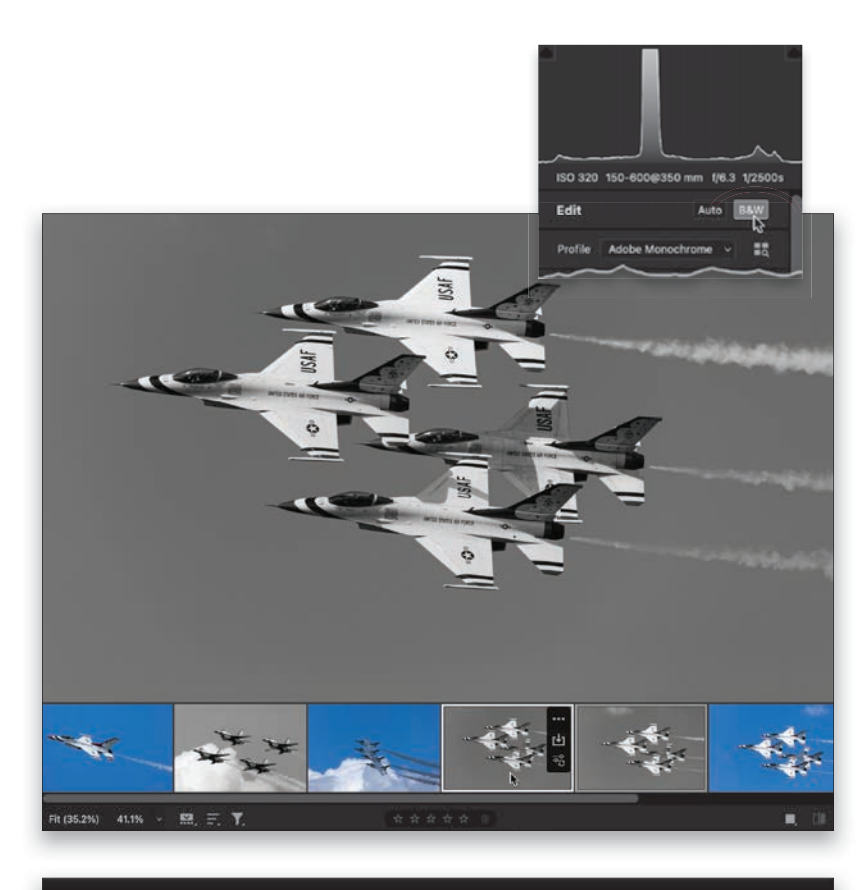
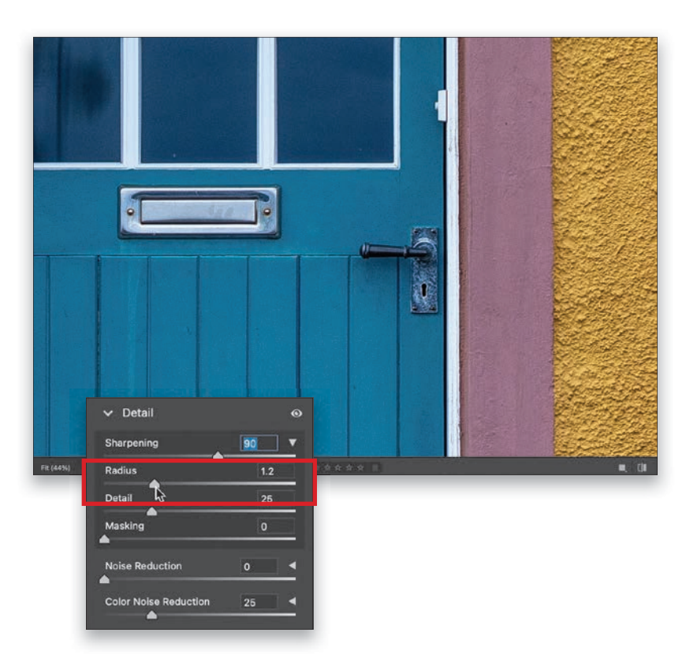
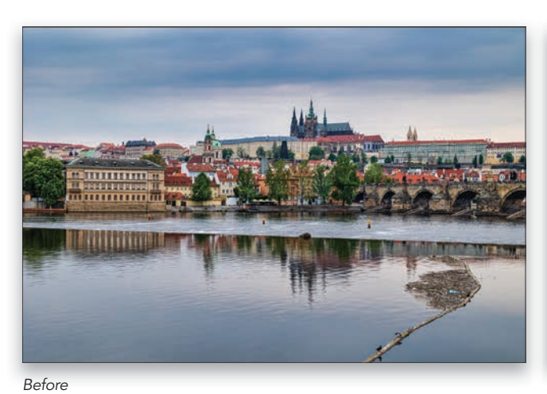
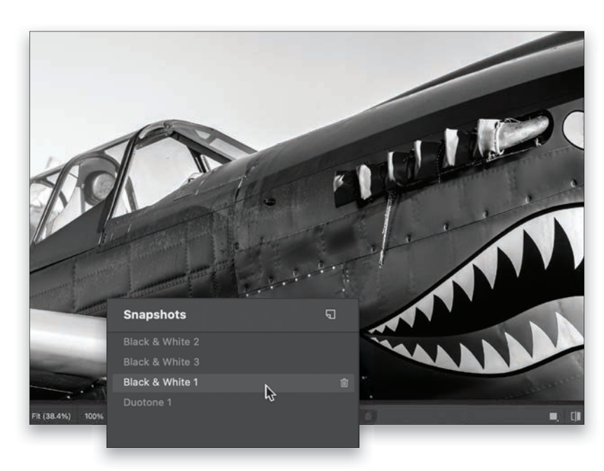
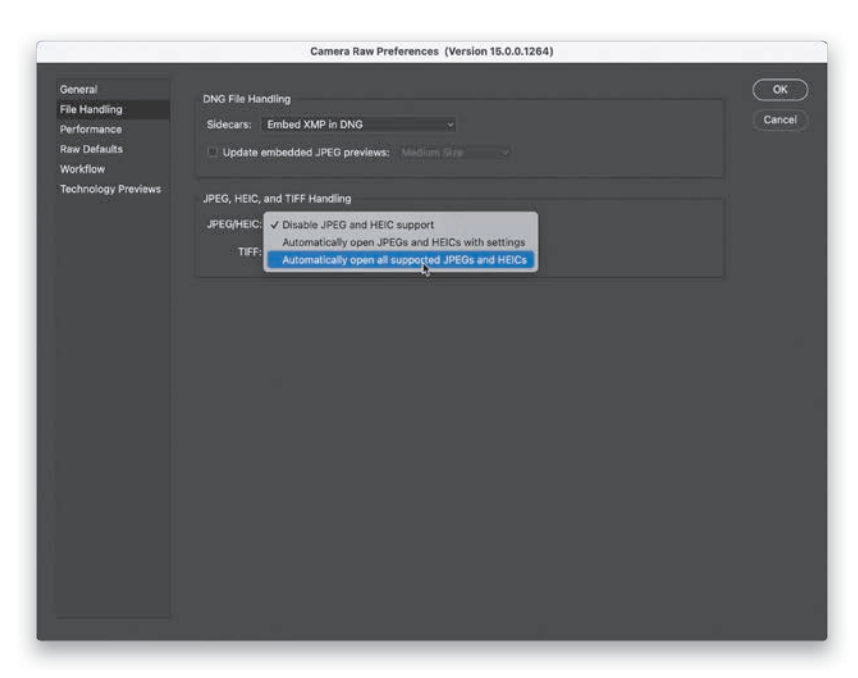
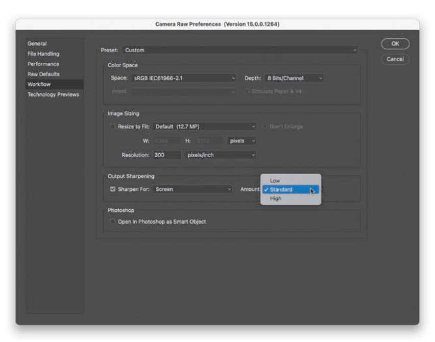

## Camera Raw – 超越基础知识

我不得不说，在第一章的开场白之后，我有点惊讶地看到你又回到了这里，因为那篇文章，…，它就是它，所以让我们继续前进吧。 不过，我还是想继续说下去，因为这显然起了作用，因为你又来了。 好的，我们继续之前的话题，我找到了另一部花胶电影标题，来自那个早期的1960年代，显然那是一部非常“无拘无束”的电影时代，因为在那个列表中有另一部电影，它会成为这一章的完美标题：_London in the Raw_。 和上一部一样，这部电影乍听起来有点挑逗，但它是 1964 年上映的（比我出生早 41 年），所以我不得不想象，那时的电影制作业在这 12 个月里已经成长和成熟了，所以这不会是另一部庸俗的电影。 唉，当我看到电影海报时，我的希望破灭了。 正上方写着："所有的罪恶......所有的震撼......所有的魅力！"我承认这让我有点担心。 但随后，在大本钟（其实叫伊丽莎白塔，塔内的钟叫 "大本钟"）的高线图下，海报左上方写着："世界上最伟大的城市，尽收眼底！"这时，我才知道这是一部关于旅行和度假的电影，而人们在旅行时会拍很多照片。

所以，我觉得这个标题非常适合第二章，然后，当我看到海报上的副标题时，我对自己的选择感觉好多了。 上面写着："好孩子和淘气包的新面貌。 精选与猥亵！" 那么，让我们来分析一下：首先，它包括 "好 "的东西（如果不是真的，他们就不能在海报上这么说，对吗？） 然后，它包含了“选择”这个词，众所周知，这是我们在 Photoshop 中所做的工作的重要组成部分——我们进行选区，这就是为什么我可能应该把这篇文章留到选区一章，但我就是等不及这本书那么久了，因为我非常喜欢伦敦，海报上写着， “世界上最伟大的城市…" (如果不是真的，他们也不可能在电影海报上这么说）。 但是，真正让我大开眼界，并将其作为第二章非书面章节标题的，是海报下方所写的内容："红红火火！ Red-Eyed & Raw. 看吧！" 拜托，这可是非常引人入胜的销售文案，而且在文案中还包含了 "Raw"（Camera Raw 的一半名称），怎么会有人抵挡得住它的诱惑呢？ 至少在开庭审理时，我是这么打算告诉法官的。

### 同时编辑多张照片

使用 Camera Raw 的最大优势之一是，它能让你对一张照片进行修改，然后轻松地将这些修改应用到其他类似照片中。 它是一种内置的自动化形式，可以在编辑拍摄时为您节省大量时间，尤其是当您有一组在类似光线条件下拍摄的照片，或者有一组照片都存在您想要解决的类似问题时。 这个超级方便。

#### 第一步

在 Adobe Bridge 中，首先选择要编辑的图像（单击其中一张，按住 Command [PC:
Ctrl] 键，然后单击所有其他图像）。 如果是 RAW 图像，只需双击其中任何一张，它们就会在 Camera Raw 中打开，但如果是 JPEG 或 TIFF
图像，则需要选中它们，然后按**Command-R（PC：CtrlR）** 或点击窗口顶部的**在 Camera Raw 中打开**
图标。 如果不使用 Adobe Bridge，只需在电脑上选择一组 RAW 图像，双击其中任何一张，它们就会全部在 Camera Raw 中打开。

#### 第二步

编辑多张照片有几种方法，但我要从我最常用的方法说起。 在 Camera Raw 中打开图像时，你会看到窗口底部有一个胶片带，上面有你选择的所有图像的缩略图，默认情况下第一张图像会突出显示。 如果这是您要编辑的图像，并且所有其他图像的编辑都以它为基础，那么您可以继续进行第三步，但如果您要编辑的图像与您选择的第一张图像不同，只需在胶片带中点击它即可，（就像我在这里所做的那样，因为我想编辑左起第五张图像，我希望对该图像所做的更改能应用到其他图像上。 但是，要做到这一点，我还需要一个步骤）。

#### 第三步

要选择胶片带中的所有其他图像，请按**Command-A（PC：Ctrl-A）** 或右键单击任意缩略图，然后从弹出菜单的顶部选择**全选**。 现在，所有缩略图都被选中，但你会注意到，你最先点击的图片有一个白色的粗边框突出显示出来。 这让您知道这是“最受选择”的图像（Adobe 是这么称呼的，不，我不是编造的），并且您对这张“最受选择”的图像所做的任何编辑都将自动应用于所有其他选定的照片。

顺便说一下，如果您不想在胶片带中对选定的照片进行编辑，只需用命令单击（PC：按住 Ctrl 键单击）它即可取消选择，这样它就不会收到您的修改。

#### 第四步

让我们对这些图像进行四项简单的编辑： (1) 将 **色温/Temperature** 滑块向左拖动一点（至 5300），为照片添加更多的蓝色。 (2) 把 **对比度/Contract** 向右拖动（我拖到了 +24），增加一点对比度。 (3) 将 **"纹理/Texture"** 滑块向右拖动（至 +23），以突出喷气机的纹理；(4) 增加 **"自然饱和度/Vibrance"** 滑块（至 +21），使天空的颜色更加饱和。 现在向下看胶片带，你会发现其他选中的图像都应用了相同的编辑（回看上一步中的图像，你会真正看到区别）。 如果单击“完成”按钮，则会关闭 Camera Raw 窗口，但会将这些设置应用于图像，因此，如果将来打开其中任何图像，这些图像将已应用这些设置。 如果单击 "打开"，所有选中的图像都会在 Photoshop 中打开。 好了，这是第一种方法，也是我目前用得最多的一种。 接下来是第二种方法。

#### 第五步

第二种方法更像是一种 “复制和粘贴” 方法（您对一张图像进行编辑，然后将这些编辑复制并粘贴到其他图像），但您可以选择复制哪些编辑。 如果你在 Camera Raw 中打开了大量图像，但只有几张需要进行特定的编辑，这就非常方便了--你可以在胶片条中选择哪些图像需要进行这些编辑。 首先点击胶片带中的照片，然后对其进行任何编辑。 在这里，我点击第二张图片，然后点击编辑面板顶部的 **黑白/B&W按钮**（如插图所示）。 然后，您可以使用标准的复制快捷键 **Command-C (PC：CtrlC)**，将这些编辑内容复制到内存中，然后命令单击 (PC：Ctrl-click) 胶片带中的其他图像以选中它们（在这里，我选中了第四和第五个图像），然后按 **CommandV (PC：Ctrl-V)**，将这些编辑内容粘贴到这些选中的图像上。

#### 第六步

如果您对一张照片进行了编辑，但只想将其中的一些编辑应用到其他图像上，那么首先选择您编辑过的照片，然后在您希望进行相同编辑的胶片带中的其他图像上按 Command 单击
（PC：Ctrl-click）来选择它们。 现在，右键单击任何选定的图像，然后从弹出菜单中选择 **Sync**
设置。 在“同步”对话框中，您将看到一个列表，其中包含您可以从“最选中”的照片中复制并应用于其余选定照片的所有内容。 在这种情况下，我只想同步我的裁剪，因此我将关闭除 **裁剪/Crop** 复选框之外的所有内容（如此处所示）。 顶部的 "子集/Subset" 弹出菜单会为你打开单个编辑，节省你的时间，你也可以选择 "全部 "打开所有编辑，或选择 "无" 关闭所有编辑。

### 使用曲线实现高级对比度

对比度/Contract 滑块非常棒，但操作非常简单--向右拖动则对比度更高；向左拖动则对比度更低。

然而，曲线面板（对比度滑块的前辈，也是更聪明的同胞兄弟）能为你提供更具体、更精细的控制，而且它能做的远不止调整对比度（例如，你可以通过编辑单独的红、绿、蓝通道来实现色彩效果，如交叉处理）。 最后需要注意的是：我们通常在基本面板中完成基本调整后再添加曲线调整，因此在完成基本调整后再应用曲线调整。

#### 第一步

在 Camera Raw 中，曲线面板是第二个面板，就在基本面板下面。 点击后，您将看到参数曲线
（两种曲线类型之一），您可以使用下方的四个滑块调整曲线的不同部分（即对角线）。 当你拖动其中一个滑块时，它就会为你移动曲线的相应区域，但这是功能较弱的曲线版本（我认为这是默认曲线，因为控制较少，所以别人弄乱图像的可能性较小）。

我们使用曲线是为了获得更强的控制能力，因此我完全不使用参数曲线，而是推荐使用功能更强大的点曲线。

#### 第二步

要使用点曲线（两种曲线中较好的），请在面板顶部 "调整" 右侧，点击第二个图标
（灰色圆圈），**点曲线** 就会出现（滑块会消失，因为您将通过在对角线上添加点，或使用 "目标调整" 工具手动调整曲线。 稍后我会解释这两个问题）。 现在我们已经找到了正确的曲线，只需直接点击对角线，就可以为其添加调整点。 首先在正中间添加一个点（如图所示）。 如果弄错了，请单击该点，然后按 Delete（PC：
Backspace）键，或者直接在曲线面板外单击并拖动该点，将其删除。

#### 第三步

在我们深入研究之前，先来看看它的基本工作原理：如果你点击并向上拖动你添加的中心点（控制图像的中间调），就会使中间调更加明亮。 如果点击并向下拖动，就会使它们变暗。 我知道这听起来很简单，但事情就是这样。 当你开始在这条对角线上添加更多的点时（从现在起，我们称之为 "曲线"），灵活性就体现出来了。

例如，如果你在中心点的两侧添加点，就像我在这里所做的那样（两个端点已经为你准备好了），曲线现在可以让你控制整个色调范围。 左下角的点控制黑色，下一个向上的点控制阴影区域，中间的点控制中间调，下一个向上的点控制高光，然后右上角的点控制白色（您可以在右边看到它们的标签）。

#### 第四步

在曲线上添加点后，您可以点击并拖动这些调整点，或使用键盘上的 **箭头键**
来移动它们。 如果按住 Shift 键，然后按一个箭头键，移动的增量会更大。 如果任何时候您想从头开始（删除已添加的任何点），请进入点曲线弹出菜单并选择线性，这样您就可以重新获得一条平直的曲线 （如图所示；它实质上是一个重置按钮）。 顺便说一下，曲线后面的直方图并不会随着你调整曲线而改变--它显示的是你调整曲线前图像的直方图，所以它是静态的。 好了，现在我们来使用曲线添加对比度。

#### 第五步

这里有用于添加对比度的内置预设，你可以从上一步用于重设曲线的点曲线弹出菜单中选择这些预设。

要添加一条能产生对比度的曲线（高光部分更亮，阴影部分更暗，但中间调不变），请从 "点曲线" 弹出菜单中选择**中** 对比度（如图所示）。 现在再看这条曲线，你会发现它呈现出微妙的 "S" 形（毫不奇怪，这就是所谓的 "S 曲线"）。 您可以看到，与第一步相比，这张照片的对比度提高了很多。

#### 第六步

如果你想获得更大的对比度，可以从同一个弹出菜单中选择 "强对比度"，这样就可以创建一条更陡峭的曲线
（如图所示），这就是我们如何使用曲线创建更大对比度的方法。

简而言之，曲线越陡，图像的对比度就越高。 因此，如果您点击并拖动高光点向上，阴影点向下，就会使 S 型曲线更加陡峭，图像的对比度也会更高。

#### 第七步

好了，你创造了一条更陡峭、对比度更强的曲线，对吗？ 如果您想将此曲线保存为预设，以便在其他照片上应用相同的曲线，而不必每次都从头开始重新创建，请按 **CommandShift-P (PC: Ctrl-Shift-P)** 弹出创建预设对话框。 从顶部附近的子集弹出菜单中选择 "曲线"，就会关闭所有其他可用预设设置的复选框，只保留**曲线复选框**（如图所示）。 给预设取个名字（我取名为 "对比度更强"），然后点击确定。

_注意：_ 这一新预设不会出现在我们一直使用的点曲线弹出菜单中。 创建的预设会出现在预设面板中，按 **Shift-P** 或点击 Camera Raw 右侧工具栏底部类似两个重叠圆圈的图标即可进入预设面板。

#### 第八步

如果这一切让你有点胆怯，我有一个工具可以帮你：它叫做 "目标调整工具"（简称 TAT），你可以在 "调整" 图标的右边找到它（下图中圈出的就是它）。

使用方法非常简单：单击该工具，将其移至图像中需要调整的部分，然后单击并向右拖动即可使该区域变亮，或向左拖动即可使该区域变暗（这将移动曲线中代表图像该部分的部分）。 因此，对于这幅图像，首先从 "点曲线" 弹出菜单中选择 "**线性**"来重置曲线（删除我们添加的所有现有点），然后单击 TAT，再单击天空并向左拖动（如图所示）。 这会在控制这些色调的区域的曲线右侧添加一个点，然后当你向左拖动时，会将该点向下拖动，使该区域变暗。 (最后我把点又往下拖了一点）。

#### 第九步

让我们点击另一个要调整的区域（只是为了掌握使用 TAT 的窍门）。 让我们点击山丘中央的一侧，然后向右拖动，使该区域变亮（如图所示；我还在这个点的正上方添加了另一个点）。

_注意：_ 一旦应用了点，该区域就会被 "锁定"。 你会发现，当你向右拖动以淡化该区域时，你在上一步中添加的点被锁定在原位。 因此，虽然曲线的其他部分可能会移动和弯曲，但你之前放置点的区域却不会移动。 它被锁住了。

#### 步骤 10：

要想突出天空的颜色，点击右上角的点（控制白色的点），然后向左拖动一点，再看看现在的天空。 如果将这一点直接向下拖动，就会使白色变得柔和，从而产生更多的胶片效果。

#### 步骤 11：

下面是使用曲线的前后对比（我没有像通常那样先做任何基本编辑，只是为了让你看看曲线对图像的影响）。 但还是那句话，首先要进行基本的编辑，然后再使用曲线）。 在结束之前，让我们来看看另一项曲线功能，即调整点曲线中各个 RGB
（红、绿、蓝通道）曲线的功能。 要进入其中一个单独的颜色通道，请单击 "调整" 右侧的色环（你一定想知道这些色环有什么用，对吧？） 好的，但在深入研究之前，我们先重置曲线（从 "点曲线" 弹出菜单中选择 "**线性**"），然后前往 "编辑 "面板，点击 "**自动 "按钮**给我们一个起点，然后再回到 "曲线 "面板。

#### 步骤 12：

现在，点击**绿色色环**，选择绿色通道。 查看这些颜色通道的好处是（以前并非如此），曲线后面的图形区域现在会显示如果将曲线向特定方向拖动将调整的颜色。 例如，如果我们想在这张图片的中间调中加入洋红色，我们可以点击曲线的中心点，然后向下拖动至洋红色。 如果我们想添加绿色（顺便说一下，我们确实想这样做），我们可以添加一个中心点，然后向上拖动到绿色（下一步，我们就会这样做）。

#### 步骤 13：

这是另一张之前/之后的照片，你可以看到中间色调的微调给画面增添了多少绿色（你可以看到我只是稍微调高了一点）。 如果您希望图像中的绿色少一些，您可以向下拖动，远离绿色，以中和图像中的绿色。

#### 步骤 14：

另一个很好的功能是可以在彩色通道上使用 TAT。 例如，如果您想让天空变得更蓝，请单击**蓝色色环**，然后单击 TAT，然后在天空上单击并拖动它。 向右拖动会在高光部分添加更多的蓝色（如图所示），因为它会在你点击的地方添加一个点，由于你点击的是天空，所以会在曲线的高光区域添加一个点。 向左拖动会在高光部分添加黄色。 你可以看到它还为大海增添了蓝色，因为那也是这幅图像中的一个亮点区域。 现在，你需要对每张照片都做这些检查吗？ 不，你不需要。 你可以使用基本面板的滑块来实现很多功能（事实上是大部分功能），但如果你想要更高的对比度以及对对比度应用方式的更多控制，现在你知道如何使用曲线来实现了。

### 在 Camera Raw 中捕捉锐化效果

我们可以进行三种不同类型的锐化。 第一种叫做 "捕捉锐化"（我们将在这里介绍），它是为使用 RAW 格式拍摄的用户准备的，因为它可以取代如果使用 JPEG 格式拍摄时在相机中应用的锐化（尽管我仍然会增加锐化）。 第二种方法是可选的，称为 "创意锐化"，即使用锐化来引导观众的视线（因为我们会被图像中非常锐利的区域所吸引）。 现在，如果你要在网上分享图像或打印图像，那么你可以进行所谓的 "输出锐化"，但我们在 Camera Raw 中不会这样做（这在 Photoshop 中稍后会处理；我们将在第 12 章中再次讨论锐化）。 接下来，我们将介绍创意锐化。

#### 第一步

要在 Camera Raw 中应用捕捉锐化，请转到细节面板，在顶部会看到**锐化**滑块。 如果您使用 RAW 格式拍摄，您会看到图像中已经应用了 40 的默认值（如图所示）。

这是因为当您使用 RAW 格式拍摄时，相机会关闭内置锐化功能，因此 40% 的锐度可以弥补相机损失的部分锐度。 如果您在相机中使用 JPEG 格式拍摄，Camera Raw 中的锐化量将设置为零。 为什么？ 因为您的相机已经在机内进行了捕捉锐化处理。

#### 第二步

实际上，除了锐化滑块之外，还有更多的锐化控制功能。 如果点击其右侧向左的三角形，就会显示另外三个滑块，可用于大幅扩展 Camera Raw 的锐化功能。

你还会在面板底部看到一条提示，告诉你要想准确地看到锐化应用的数量（或者更现实地说，根本看不到锐化应用的数量），你需要以 100% （1:1）的视角查看图像，如果你现在不是以 100% 的视角查看图像，那你就有点盲目了。 因此，按**Command-+**（加号；**Ctrl-+**）放大到 100% 视图，直到在左下角看到 100% （我在这里放大到了 200%，这样你就能更清楚地看到我们将在书中应用的锐化效果）。

#### 第三步

同样，我们使用**锐化滑块**来调整应用于图像的锐化量（我知道，咄咄逼人），如果你使用 RAW 格式拍摄，请记住，Adobe 已经将 40 设置应用于你的 RAW 图像。 问题是，我觉得默认设置 40 太低了。 实际上是相当低的，尤其是如果您使用的是高像素相机（3600 万像素或更高，那就太低了！）。 我还没有发现一张照片不需要锐化超过 40% 的捕捉锐度。 我通常在 50（低端）到 70 之间，具体取决于图像的类型（我在有大量细节的图像上使用较高的数量，如风景、汽车拍摄、城市景观等，而在肖像或主体性质较柔和的图像上使用较低的数量）。 在这里，我把它调到了 90，因为这张照片有很多细节、金属和纹理。

#### 第四步

最后，捕捉锐化的程度由您决定。 此外，Adobe 在谈到锐化和向右拖动锐化滑块时是这样说的："在大多数情况下，您只需这样做"（这是直接引用）。

因此，你可以继续阅读本章的其他部分，但你会错过一些我们尚未涉及的锐化内容，如**半径滑块**。 这让您可以选择锐化的范围。 下面是 Adobe 对半径的描述："…它控制应用对比度的边缘的厚度。 数值越低，边缘越薄，数值越高，边缘越厚"。

嗯，很有帮助。 总之，在日常使用中，我会将其设置为 1.0，但如果真的需要一些超大锐化，我会将其提升到 1.1 或 1.2。 要注意的是，如果将这个值调得过高，物体边缘就会出现白线或硬边光晕，因此我通常会调低锐化值，而不会过多增加半径值。

#### 第五步

半径滑块下方是**细节**滑块。 别碰它 它现在就很完美。 我把它看作是 "避晕滑块"。 它的作用是防止出现我们刚才提到的光晕，如果增加它的用量，实际上就会取消光晕保护，使锐化效果更粗糙、更有 "光晕"（如果这也算一个词的话）。 所以我根本不碰这个滑块。 顺便说一下，如果将细节滑块一直向右拖动，就能获得与 Photoshop 的 "非清晰蒙版 "相同的锐化效果。

不幸的是，随之而来的是（等着吧…等着吧…) 光晕，所以我不移动它。 通过将 **细节/Detail 滑块**保留为默认设置 25，我们可以对图像进行更多锐化，而不会产生任何使用 Photoshop 的 Unsharp Mask 的不良副作用。

#### 第六步

最后一个锐化滑块 "蒙版/Masking" 对我来说是最神奇的，因为它可以让你精确控制锐化的应用位置和不应用位置。 例如，有些照片的某些区域应该是柔和的，如风景照片中的云彩或妇女或儿童的皮肤，因此您不希望锐化这些区域。 但与此同时，你也需要细节部分的清晰度。 蒙版滑块会屏蔽掉那些柔和的区域，因此锐化的主要是细节区域。 例如，在上一步中，你可以看到门上的木头和黄色的墙壁上有一些噪点，但我们可以使用 "蒙版/Masking" 滑块对门把手和邮件槽进行大量锐化，而其他部分则不锐化。

为此，请按住**Option**（PC：Alt）键，然后单击并按住蒙版滑块，图像就会变成纯白色（如图所示）。 这幅纯白色的图像告诉你的是，锐化正在均匀地应用到图像的每个部分，所以基本上所有的部分都得到了锐化。

#### 第七步

当你点击并向右拖动 "蒙版/Masking" 滑块时，照片的部分区域将开始变黑，而这些黑色区域现在不会被锐化，这正是我们的目标。 一开始，你会看到一些黑色斑点，但拖动滑块越远，越多的非边缘区域会变成黑色--如图所示，我将 **蒙版滑块** 拖到了 77，这几乎让门上的木头全变成了黑色（所以这些区域现在没有被锐化），但细节区域，如门的边缘、门把手和邮件槽--仍然显示为白色的区域--都被完全锐化了。 你只锐化了细节部分，如果你问我，这真的是非常巧妙。

#### 提示：切换关闭锐化功能

如果想暂时关闭在 "细节/Detail" 面板上所做的更改，只需点击面板标题最右侧的小眼睛图标即可。

#### 第八步

我在锐化女性肖像时也会用到这个蒙版滑块，因为锐化会突出纹理和毛孔，而这正是你不想要的。 但与此同时，我们也需要细节部分的清晰度，比如他们的眼睛、头发、眉毛、嘴唇、衣服等。 蒙版滑块就可以做到这一点--它可以遮挡皮肤区域，因此锐化的主要是细节区域。 为了演示如何操作，我们要切换到人像模式。

#### 第九步

按住 \*\* 选项（PC：Alt）\*\* 键，然后单击并按住蒙版滑块，图像区域将变成纯白色（如图所示）。 这再次告诉你，锐化正在均匀地应用到图像的每个部分，所以基本上，所有的东西都得到了锐化，包括她的皮肤和所有东西。

#### 步骤 10：

当你点击并向右拖动 **蒙版** 滑块时，照片的部分区域将开始变黑，而这些黑色区域将不再被锐化。 在这里，我拖动到 80，皮肤区域几乎全黑（因此没有锐化），但细节边缘区域，如她的眼睛、嘴唇、头发、鼻孔和轮廓，则完全锐化（这些区域仍然显示为白色）。 因此，在现实中，那些皮肤柔软的部位会自动为你遮盖起来。 当你松开 Option（PC：Alt）键时，你会看到锐化的效果，细节区域非常清晰，但她的皮肤好像从未锐化过。

### 创意锐化

创意锐化是可选项。 这种锐化只应用于图像的一个或多个区域，通常是为了吸引观众的眼球，因为我们的眼睛会首先被图像中最亮的部分吸引，然后被最锐利的部分吸引，所以这是引导观众的有效方法。 同样，这也是完全可选的（而捕捉锐化应该对每张照片都进行，尤其是在您使用 RAW 格式拍摄时，但如果您使用 JPEG 格式拍摄，就不需要应用那么多锐化，因为您在拍摄时已经在相机中对图像进行了锐化。 正如我提到的，我们将在第 12 章中再次讨论锐化问题）。

#### 第一步

这种可选的锐化类型是在应用捕捉锐化后添加的，可以使用蒙版画笔来应用，这样就可以只对想要引起注意的区域进行锐化。 例如，在本例中，如果您想为钟面和建筑物添加一些创意锐化效果，第一步是点击右侧工具栏中的蒙版工具（M），然后在出现的工具面板中点击**画笔**（如图所示；或者直接按**K 键**获取画笔工具并创建蒙版）。

#### 第二步

现在，向下滚动到 "细节" 面板，您会发现 **"清晰度"** 滑块。

这只是一个简单的滑块，向右拖动的距离越远，锐度就越高。 在这里，我将其拖动到 +40，然后在时钟（如图所示）和建筑物上进行了涂抹，结果使该区域更加清晰，吸引了观众的目光。

这就是创意锐化的全部内容。

另一种情况是，我们希望在肖像画中突出眼睛。 不过，你不必使用画笔工具，因为当你选择蒙版工具时，可以点击人物（在其工具面板中），然后点击人物缩略图，在可以蒙版的面部特征列表中，你可以选择虹膜和瞳孔，然后点击创建。 然后向右拖动锐度滑块，就可以只锐化虹膜和瞳孔--无需上色。

### 清除斑点、灰尘和其他干扰物

如果图像上有斑点，或者拍摄对象脸上有简单的瑕疵，你可以在 Camera Raw 中使用 "修复/Headling" 工具修复很多这类问题。

#### 第一步

这是一张天空中出现大量传感器光斑和垃圾的照片，虽然在这么小的尺寸下看不清楚，但放大后就会发现非常糟糕。

首先，从右侧的工具栏中获取 "修复/Headling" 工具 (B)（其图标看起来像创可贴）。 你会在其面板顶部看到三个不同的修复选项，但真正有效的只有一个，即第一个选项，**内容识别移除**（它是橡皮擦图标，这里用红色圈起来）。

中间的 "修复" 图标是 "斑点去除/Spot Removal"工具，该工具已在 Camera Raw 中使用多年，整体效果非常糟糕。 一直如此。 这就是为什么我避而远之的原因，尽管它的名字听起来很适合做这个，但它就是…不好。 第三个图标是 "克隆"（Clone），这个图标比较特殊，不应该与 Photoshop 出色的 "克隆图章"（Clone Stamp）工具混淆，Camera Raw 中的这个图标并不出色。 因此，简而言之，第一个图标是好图标。 其他的呢？

跳过他们。

#### 第二步

放大天空后，可以非常清楚地看到这些斑点（这只是天空中的一小块区域）。 在 Camera Raw 中，你可以用与在 Photoshop 中相同的方法放大--**Command-+**（加号；**PC：Ctrl-+**）放大，**Command--**（减号；**PC：** Ctrl--）缩小。 在这里，我放大到 300%，哎呀！ 有很多东西要清除。 _注：_ 按住**空格键**可在图像上移动。

#### 第三步

使画笔比要删除的位置稍大一些（使用键盘上的括号键可以快速改变画笔大小，括号键位于标准美式键盘上字母 P 的右侧--**右**括号键可使画笔变大；**左**括号键可使画笔变小）。

当你的笔刷比你要删除的位置稍大一点时，只需将光标移到该位置上并单击一次即可。

这样就可以了。 只需点击

不要画画。 点击一次，它就会消失（如图所示）。

#### 小窍门对于较大的斑点或斑点

这是我处理小斑点和小点的方法，如果你有一些更大或更长的斑点和小点，你可以使用设置为 "内容识别移除" 的 "修复/Healing" 工具在它们上面画一笔。 如果还不行，Camera Raw 以外的其他工具也能解决这个问题，所以在这个阶段不用太担心。

#### 第四步

这就是它的全部功能：将光标移到一个点上，然后点击。 现在，如果不起作用怎么办？ 如果修复效果不佳怎么办？ 您可以要求 Camera Raw 在图像中选择不同区域取样进行修复。 您可以通过单击“刷新”按钮或按下键盘上的 **正斜杠键** 来执行此操作。 它会选择一个新的位置，这通常会起到作用。 如果没有，你的第二道防线就是按住 Command（PC：Ctrl）键，在图像的干净区域上点击并拖动，它就会使用该区域进行修复（当然，面板底部就有说明，但我不能忽略，以防你像很多人一样，忽略 Adobe 放在那里的东西，因为有时这些东西一点意义都没有，但在这种情况下，它其实很清楚，所以…好了，就这样吧）。

### Camera Raw 可以显示斑点的位置

最糟糕的事情莫过于打印出一张漂亮的大图像后，却在图像中看到各种传感器灰尘、斑点和小点。 如果您拍摄风景或旅行照片，在蓝天或灰蒙蒙的天空中很难看到这些斑点，如果您在摄影棚用无缝纸拍摄，情况也一样糟糕（也许更糟）。 我想我应该说：以前很糟糕。 现在，这绝对是一件轻而易举的事，这要归功于 Camera Raw 中的一项功能，它能让每一个小斑点和小污点都非常显眼，让你可以快速去除它们！

#### 第一步

我们在这里使用的是同一张图片，只是其中的不同部分。 这里有很多光点，当它们出现在这样繁忙的天空中时，很容易被忽略，但同样，Camera Raw 可以准确地告诉你这些光点的位置。 因此，从右侧的工具栏中获取**修复工具 (B)**，当面板出现时，确保第一个图标 "**内容感知删除**" 被选中（如图所示）。

#### 第二步

在修复面板的底部，有一个 **可视化斑点复选框**。

打开该复选框，就能获得图像的反转视图（将图像变为黑色，保留白色轮廓的斑点）。 现在，慢慢地向右拖动 "**可视化斑点**" 滑块，然后再向左拖动，斑点就会开始清晰地显现出来（在本例中，我最终将滑块向左拖动，使它们真正地凸显出来。 当我把它向右拖动时，白色变得太白，膨胀得有点厉害）。 现在，只需使用 "修复" 工具，在每个点上点击一次（就像我在这里做的），就能将它们去除，直到它们全部消失。

### 删除（擦除）照片中的干扰物

好了，我们刚刚介绍了如何去除图像中的斑点和小点，但如果你需要去除的东西比斑点和小点更大，而且去除更大的东西更棘手，该怎么办呢？ 那么，你可以这样做：

#### 第一步

从右下角的脏白色管道和杂物，到中间的岩石，以及桥前水中的小标记，这张照片中有许多干扰因素需要去除。 所有这些都分散了人们的注意力，破坏了查理大桥及其后面区域的美感。 要删除这些东西，点击右侧工具栏中的**修复工具（B）**（其图标看起来像创可贴），然后在出现的面板中点击第一个图标（看起来像橡皮擦），这是 **内容感知**删除 选项（这是三个选项中唯一好的一个，我在之前的技巧中提到过）。

#### 第二步

让我们从右边的垃圾开始。 按几次**Command-+**（加号；PC：Ctrl-+）放大，然后按住**空格键**
，在图像上点击并拖动，直到你能清楚地看到那个垃圾区域。 接下来，使用键盘上的左右括号键（在字母 P 的右边），将画笔的尺寸调到比脏管子稍大一些。 我发现有时候最好是分批次删除这样的东西，而不是一次性全部删除。

那么，让我们把管道和中间的那团大混乱一起涂过去，但是顶部右侧部分我们留到以后再处理。

在这里，你可以看到我用画笔画出的细细轮廓。

#### 第三步

有时，这种方法第一次就能完全奏效，但这次却不行。

正如你在这里看到的，它留下了一些垃圾。 不过，虽然它没有做得完美，但它为我们做了大约95%的工作，现在我们只需要对它错过的一些地方进行一些微小的修改。 所以，如果它不是每次都完美运行，请不要感到沮丧。 只需看看它做对了什么，即去掉大部分我们想要的东西。 同样，有很多时候，这样做的第一次效果绝对完美。

但是，我故意选择了一张我知道会比较难修复的图片，因为你会时不时遇到这种情况，你会想知道如何思考和处理它。

#### 第四步

现在，我们需要清除的不再是肮脏的管道和一些垃圾，而是一些大块的污渍。 因此，调整画笔的大小，使其比要删除的位置稍大一些，然后将光标移到该位置上，单击一下，它就消失了（如图所示，我只需单击一下就删除了底部漏掉的那个大点）。 有时，它漏掉的地方会更长或更大一些，你不得不在这些地方涂上油漆，但没关系--你会很快得到它漏掉的这些地方。 您可能还需要多次点击同一区域，才能获得所有残留物。 如果您单击但未能完全清除这些剩余物，您可以让 Camera Raw 选择图像中的其他区域进行修复，方法是单击**刷新按钮**或按下键盘上的 **正斜杠键**。 如果还不行，按下撤消键\*\*（Command-Z [PC：Ctrl-Z]）\*\*，然后按住 Command (PC：Ctrl) 键，在图像的干净区域上拖动，它就会使用该区域进行采样，希望这样能起到作用。

#### 第五步

这是清理剩余物品的15秒钟后的结果。 我不得不在一些地方点击几下，才能让它们完全消失，我也不得不画一些笔画，但它们已经基本消失了（你可以多花一点时间来让它完美）。 现在，让我们把一开始没有包括在内的管道和垃圾的顶部区域涂上一层。 它能做得很好，但你可能还需要清理一些残留物。 完成后，移到中间的岩石上，增大画笔的大小，使其大于岩石，然后点击它（如这里的插图所示）。

第一次点击时，它没有把水线画得完全笔直，所以我把画笔变小，点击剩下的部分，结果就解决了。 对岩石两侧水中的两个标记做同样的处理，就大功告成了。

### 调整或更改颜色范围

在下一章中，您将学习如何在图像的任何部分上绘制调整，但有时您需要影响整个区域（比如您需要整个天空变得更蓝，或者沙子更温暖，或者一件衣服需要成为完全不同的颜色）。 在大面积调整的情况下，使用 HSL 调整通常会更快，它不仅可以改变颜色，还可以改变颜色的饱和度和亮度。 它比你想象的更强大、更方便。

#### 第一步

这是我们的原始图片，我们的拍摄对象穿着一件蓝色上衣。 我们要做的是调整她上衣的颜色，使其更加突出。 您可以在 Camera Raw 的 Color Mixer 面板中调整单个颜色或一系列颜色，因此请向下滚动到右侧面板中的该面板。 若要更改颜色，请单击顶部的 **色相/Hue 选项卡**（如图所示）。

#### 第二步

与其猜测哪个滑块会改变她上衣的颜色，我建议你在面板右上角眼睛图标下方使用目标调整工具（简称 TAT），在她的上衣上单击该工具，然后向右拖动（单击时屏幕上会出现两个彩点，帮助你知道向哪个方向拖动才能得到想要的颜色）。

当你这样做时，它就会知道哪些滑块可以控制该区域，并为你移动它们（在本例中，它将蓝调滑块移动了很多，但也将紫调滑块移动了一点）。 您可以从这里看到她上衣的不同之处。

#### 第三步

如果要降低图像中某一颜色的饱和度，请单击**饱和度选项卡**（如此处红色矩形所示）。 现在，取下 TAT，再次单击她的上衣，然后向左拖动，降低其中颜色的饱和度（强度）。 看看滑块，你会发现它又移动了蓝调和紫调滑块，但除此之外，TAT 知道每种颜色的正确比例，这就是为什么使用它能给你带来如此大的优势（事实上，它非常有用，如果不使用 TAT，我一般不会使用这些 HSL 滑块）。

#### 提示：省去面板的麻烦

当您使用目标调整工具时，会在窗口底部附近出现一个迷你浮动面板（如第三步中所示的图像上方），以便轻松在色相、饱和度和亮度之间切换，无需返回面板。

#### 第四步

现在，如果你觉得颜色看起来太暗或太亮，只需点击**亮度选项卡**（它控制颜色的亮度），然后点击她的上衣，向右拖动使其变亮，或向左拖动使其变暗。

在这里，我向右拖动，以提亮其颜色。 这就是调整饱和度和亮度的方法。 不过，如果你想真正改变一种颜色（而不仅仅是调整现有颜色），请再次点击色调选项卡。 你可以随时拖动滑块，最终你会发现哪个滑块控制图像的哪个部分，但我想你可以明白为什么 Adobe 发明了 TAT--让我们在这个面板中的生活更轻松。

### 消除雾霾

如果你的照片中有朦胧的区域（或有雾，或你正在拍摄水下摄影），你一定会喜欢 Camera Raw 的功能，它可以穿过朦胧的
（它真的做得很棒）。 实际上，这是一种不同形式的对比，不管出于什么原因，效果都非常好。 但是，如果你必须大量使用它，你会想知道它的副作用（你马上就会了解到）。

#### 第一步

这是我们用 Camera Raw 打开的犹他州纪念碑山谷的原始朦胧图像。

要消除背景中的雾霾，请在基本面板中向下滚动，直到看到**去雾霾滑块**（这里需要向下滚动）。

#### 第二步

要解决这个问题非常简单，只需将 **去雾霾/Dehaze** 滑块向右拖动（如左下图所示），直到雾气消失。 现在，如果你必须应用大量的去雾霾效果（就像我在这里做的那样，将滑块一直拖到 +68），它就会产生一种副作用，开始给你的图像添加蓝色色调。 如果您注意到图像上有蓝色色调，您可以通过上调 **白平衡色温滑块** 并轻微向黄色方向拖动一点（如下所示，在右下方）直到照片的颜色再次看起来正确。 如果您不想将去雾霾应用于整个图像，请按下**K键**获取**刷工具**并创建一个蒙版，将去雾霾滑块（在效果下）拖到右侧，然后只需在需要的区域涂抹去雾霾。 同样，如果该区域开始变蓝，只需将温度滑块（颜色下）向黄色方向拖动即可。

### 降噪

Camera Raw 具有内置降噪功能，如果您使用 RAW 格式拍摄，它能有效降低图像中的噪点（它也适用于 JPEG 图像，但 RAW 图像的效果更好）。 我认为这种降噪方法的问题在于，它必须让图像变得模糊一些，以掩盖噪点，所以你是在用一个问题换另一个问题，但稍微模糊的图像可能比非常嘈杂的图像更容易让人接受。 到了最后，当你对比前后的照片时，你可能（像我一样）会觉得大多数时候这样做得不偿失，这也是我很少使用内置降噪功能的原因。 只是没有超级棒（这是客气话）。

#### 第一步

这是一张在 Camera Raw 中打开的噪点图像。 我不小心用 1600 ISO 拍摄了这张照片，因为前一天晚上我在弱光环境下拍摄，忘记将 ISO 调回 100。 遗憾的是，这已经不是我第一次遇到这种情况了。

但是，这是我第一次来到纪念碑谷，所以我必须挽救这张照片。 由于我们是在接近黎明的时候拍摄的，所以天色也很暗，当你稍微打开曝光时，噪点就会非常明显，尤其是在放大时。 要进行降噪操作，请转到详细面板，并单击位于**降噪**和**颜色**降噪右侧的左向三角形以显示额外的降噪滑块（如图所示）。

#### 第二步

至少放大到 100%或更多（我放大到 300%，这样你才能真正看到噪点）。 在这里，您可以看到大量的色彩噪点（红色、绿色和蓝色斑点）和亮度噪点（颗粒状的灰色斑点）。 我通常会先去除色彩噪点，因为这样更容易去除亮度噪点。 在去除色噪时，这里有一个很好的经验法则：先将 **色彩降噪滑块** 设置在 0 的位置，然后慢慢向右拖动，直到色噪消失为止。

注：RAW 图像会自动应用一点色彩降噪功能，滑块设置为 25。 但是，对于 JPEG 和 TIFF 文件，它被设置为 0，因为相机中已经应用了降噪功能。

#### 第三步

现在，点击并向右拖动**颜色噪点**减少滑块，但记住，你仍然会看到一些噪点（这是亮度噪点，我们接下来会处理）。 因此，你要做的就是让红、绿、蓝三色斑点尽可能消失。 有可能你根本不需要拖得太远，只要拖到色噪全部变成灰色就可以了。 如果您必须将滑块推得非常靠右，可能会开始丢失一些细节，在这种情况下，您可以将其下方的“细节”滑块向右拖动一点。 不过老实说，我很少需要这样处理色噪。 平滑度滑块与上方的细节滑块配合使用，可确保颜色不会偏移。 向右拖动可确保色彩保持完整（但不要拖得太高，否则会导致色彩不饱和），向左拖动可确保色彩更加融合。

#### 第四步

现在色彩噪点已经消除，剩下的就是亮度噪点了，您可以使用类似的方法，将**降噪滑块**向右拖动。

继续拖动，直到可见噪音消失（如图所示）。 通常您需要将这个拖动到比我们使用彩色噪点减少滑块时更靠右的位置，但这是正常的。 当您必须将此滑块向右推得太远时，往往会发生两种情况：您会失去清晰度（细节）和对比度。 因此，如果画面开始变得过于柔和，只需增加其下方的细节滑块；如果画面开始显得平淡无奇，则可使用对比度滑块将缺少的对比度添加回来（在人像照片中添加对比度时要小心，因为肉色看起来会很难看）。 这是一个前后对比，就像我之前说的，"后" 并不是那么好。 这是一种权衡，但我不确定这是一个好的选择。

### 裁剪和拉直

在 Camera Raw 中裁剪照片比在 Photoshop 中裁剪照片有一个明显的优势，那就是你可以在稍后返回 Camera Raw，调出未经裁剪的图像版本。 只要您没有保存原始的 JPEG 或 TIFF 文件，这甚至对 JPEG 和 TIFF 照片也适用。

#### 第一步

裁剪工具 (C)\*\* 是工具栏顶部第二个工具。 (注：\*裁剪工具在 Camera Raw 滤镜中不可用。 只有直接在 Camera Raw 中打开图像时才能看到）。

点击它后，裁剪面板就会出现，你会看到照片外围有一个裁剪边框（如图所示），顶部、底部、侧面和角落都有裁剪手柄。 要裁剪照片，只需点击其中任何一个手柄并向内拖动即可。

#### 第二步

在这里，我点击并向内拖动了右下角。 默认情况下，当你点击并拖动手柄时，它会按比例裁剪（保持照片的原始长宽比），因此你只需拖动一边或一角，其他边就会移动，以保持裁剪比例不变。 如果想解除锁定，以便进行自由裁剪（每个手柄都可以单独调整），请在裁剪面板中点击**锁定图标**（如图所示）解除锁定。 点击并向内拖动裁剪边框时，需要裁剪的区域会变暗（如图所示），边框内的清晰区域就是最终裁剪后的照片。 要调整照片的位置，只需在边框内直接点击并拖动照片即可。

#### 第三步

除了锁定的裁剪边框和自由形式的无锁定裁剪外，还有许多具有不同裁剪边框的裁剪预设。 只需点击并按住面板顶部的**预设弹出菜单**，即可查看预设。

在这里，我选择了 1 x 1（1：1 正方形）预设。 如果您想使用自己的自定义比率，请选择 （等待它…等待它…) 从弹出菜单底部选择自定义比例。 这时会弹出对话框（如右下图所示），你可以在其中输入你想要的裁剪比例（在这里，我输入的是 2.39:1，它给你提供了一个类似于变形宽银幕电影大小的裁剪边框（我认为它给照片带来了更多电影的感觉）。

此外，1.85:1 是另一种流行的电影比例，而 1.78:1 则类似于高清（但我们有 16x9 的预设）。

#### 提示：翻转裁剪

比方说，如果您应用了宽方向裁剪，并想将其切换为高方向裁剪，只需按下键盘上的**X 键**，即可翻转裁剪。

#### 第四步

完成裁剪调整后，只需按**返回键（电脑：回车键）**。 如果点击 "打开 "按钮，图片就会按照您的要求进行裁剪，并在 photoshop 中打开。 如果单击 "完成 "按钮，则会关闭 Camera Raw，但会保留裁剪边框，以备将来使用。 这里有一件很酷的事：如果你在 Camera Raw 中再次打开裁剪后的照片，就会看到裁剪后的版本。 要恢复裁剪边框，只需点击裁剪工具。 要完全取消裁剪，请按键盘上的 Esc 键或**删除（PC：Backspace）**键，或者直接点击面板右上方的**重置为完整图标**（向下的箭头）。 现在，除了裁剪，你还可以在裁剪面板中拉直图像（下一步）。

#### 第五步

让我们看看如何拉直这张弯曲的图片（我花了 30 秒才找到一张）。 说到拉直，有四种方法可以实现：
(1) 你可以拖动裁剪面板中的**角度滑块**，随着拖动，图像会旋转。 唯一的问题是你在"盯着"它。 (2）有一个自动拉直功能，只需双击**拉直工具**（下图红圈部分），它就会自动拉直。 通常效果很好，但有时也不好，在这种情况下，…，效果根本不好。 因此，我首选的拉直方法是 (3) 手动使用拉直工具。

点击它，然后沿着图像中应该是直线的地方（就像我在楼梯上所做的）点击并拖动它。

#### 提示：取消拉直

只需按下键盘上的**Esc键**，校直就会消失。

#### 第六步

单击并拖动 "拉直" 工具后，它可以完美地拉直图像 （如图所示）。 第四种方法是将光标移到裁剪边框外，当你这样做时，光标会变成一个双头弯曲箭头。 只需点击并拖动要旋转图像的方向，它就会旋转。

### 边编辑边保存，以便进行试验

您可以在编辑过程中的任何时刻对图像进行快照，这样您不仅可以比较图像的不同编辑效果，还可以返回到其中任何一个编辑效果，只需单击一下即可将所有滑块设置到位。 这样，你就可以自由发挥创意，尝试不同的东西，也可以毫无顾虑地进行尝试，因为你总是可以回到你喜欢的上一个造型。 只要您记得保存快照。

#### 第一步

在处理图片时，如果你觉得 "我喜欢这样，但我还想继续调整"，那么请到右侧的工具栏，点击**快照**图标（**Shift-S**；它是底部第三个图标，这里用红色圈起来。

_注：_ 此功能在 Camera Raw 滤镜中不可用）。 这会弹出快照面板，并保存此刻的画面，以及到达这里所需调整的所有滑块。点击面板头部右侧的**创建快照图标**（这里也有圈出）以弹出**创建**快照对话框。 只需给您的快照取个名字，然后单击“确定”

#### 第二步

在这里，我想看看能否为这张图片制作一个黑白版本，但我想比较一下不同的黑白转换版本，看看哪一个（如果有的话）我最喜欢。 因此，在编辑时，我保存了四个不同版本（快照）的图像（三个黑白版本和一个双色版本）。

现在，我只需将光标移到面板上的名字上，就能看到并比较每个人的外观。 如果有我想使用或继续使用的照片，我只需点击一下，Camera Raw 就会从那一刻开始拾取，所有的滑块都在原位，供我继续编辑、实验，或者直接在 Photoshop 中打开并拾取。

### 选择 Raw 图像在 Photoshop 中的显示方式

在相机原始文件中编辑图像完成后，单击“打开”按钮，图像将在 Photoshop 中打开。 好消息是，如果您使用 RAW 格式拍摄，您可以选择图像在 Photoshop 中的格式。 您可以选择尺寸（物理尺寸）、色彩空间、位深度（8 或 16 位/通道）等等。 下面介绍如何按自己的方式设置：

#### 第一步

有几种方法可以进入 Camera Raw 偏好设置。 一种方法是点击窗口右上角的齿轮图标（此处用红色圈出）。 另一种方法是点击窗口底部中央那行类似 EXIF 相机数据的文字（此处也用红色圈出），或者使用键盘快捷键**Command-K**（PC：Ctrl-K）。 所以，请继续使用这些选项之一，以调出相机原始文件的首选项。

#### 第二步

在Camera Raw首选项对话框中，您会看到许多**常规**选项是很容易理解的，比如您可以选择您的颜色主题，或者您是否希望当您打开多个图像时出现的Filmstrip沿着底部（水平）或沿着Camera Raw窗口的左侧（垂直）显示。 基本上就是这些，所以我就不一一解释了（反正你也不会留下来看）。 除了常规偏好设置外，左侧一栏还列出了其他五种偏好设置，点击任何一种都可以在它们之间跳转。

#### 第三步

让我们先点击**文件处理**，因为这里有一件事你可能需要考虑一下。 在我自己的工作流程中，我不仅希望我的 RAW 照片能在 Camera Raw 中打开，还希望我的 JPEG 或在 iPhone 上拍摄的图像（苹果的 HEIC 格式）在 Photoshop 中打开之前能在 Camera Raw 中打开。 为此，请在 JPEG、HEIC 和 TIFF 处理部分，从 JPEG/HEIC 弹出菜单中选择**自动打开**所有支持的 JPEG 和 HEIC。 好了，这些选项就到此为止。

#### 第四步

接下来（在你可能真的想弄乱的东西列表中）是**RAW**默认设置，点击左侧的**RAW**默认设置。 这些是首次在 Camera Raw 中打开 RAW 图像时应用的设置。 如果将全局弹出菜单设置为默认的 Adobe 默认设置，则会使用 Adobe 的默认设置（因此会使用 Adobe 的默认值 40 为 RAW 照片添加一些锐化效果，会应用一些降噪效果，会应用 Adobe Color 作为 RAW 配置文件，等等）。

不过，如果你希望让 Camera Raw 读取你在相机中应用于 RAW 图像的设置，它也会尊重这些设置（尽其所能）。 比方说，您选择在相机中为图像应用黑白预案，因此您基本上是在黑白环境中拍摄。 当你把这些图像带入 Camera Raw 时，它们会自动转换成黑白图像。 要执行此操作，请从全局弹出菜单中选择 "相机设置"（如图所示）。 就这样。

现在，它会尊重您在相机中进行的更改，并在您在 Camera Raw 中打开它们时将这些更改应用于您的图像（而不是 Adobe 的默认设置）。

#### 第五步

那么，如果您不想使用Adobe的RAW默认设置或您相机的设置，而是想设置您自己的自定义默认设置，以及您自己的自定义相机RAW设置呢？ 然后，你要做的是关闭偏好设置对话框，然后在 Camera Raw 中设置您想要的设置。 例如，让我们在基本面板上选择 Adobe Portrait 作为 RAW 配置文件、Daylight 作为白平衡，并将曝光量增加 1/3 光圈（如左图所示），这样就可以为自然光下的人像拍摄设置一个默认值。 让我们也转到“详细”面板，并将锐化量增加到60，蒙版量增加到70（如右边所示）。 所以，这些是我们在 Camera Raw 中打开 RAW 时想要应用的设置。 现在，要做到这一点，我们必须在这些设置（仅限这些设置）到位的情况下创建一个预设，因此不要对当前图像进行其他更改。

#### 第六步

要创建 Camera Raw 预设，请转到右侧的工具栏，单击“更多”图像设置图标（它是底部的三个点，在左侧圈出），然后从弹出菜单中选择“创建预设”，这将打开“创建预设”对话框（如右侧所示）。 创建预设时，你只希望预设中包含的内容是你想要的默认设置，因此只需关闭你不想要的内容的复选框即可。 在这里，我关闭了除了配置文件、白平衡、曝光度和锐化复选框之外的所有内容。 就这样。 在顶部的名称字段中为此预设命名（这样您就可以在下一步轻松找到它；我将其命名为"New Default SK"）然后单击“确定”。

#### 第七步

现在，回到 Camera Raw 的首选项。

当对话框打开时，再次单击左侧的**原始**默认值（如果尚未选择），然后从全局弹出菜单中选择**选择**预设，然后会出现相机原始预设的子菜单。 默认情况下，我们刚刚创建的新预置将显示在用户预置下（除非你在上一步的创建预置对话框中选择将其保存在不同的组中）。 在这种情况下，我只是将其保存在默认的用户预设组中）。 因此，选择预设（如此处所示，我选择了我的 New Default SK 预设）。 就这样。 现在在Camera Raw中打开的每个RAW图像都会应用这些设置（Adobe 人像，日光，+0.30 曝光度，锐化60，蒙版70）. 好的，让我们继续吧。

#### 第八步

接下来，点击左侧偏好设置中的**工作流**，调出其选项。

图像进入 Photoshop 后，您可以在这里选择要使用的色彩空间。 选择哪种色彩空间有很多学问，但从本质上讲，你要与 Photoshop 的色彩空间设置相匹配（这很奇怪，因为我知道我们还没有讲过这方面的内容，所以这是你在 Photoshop 中选择了适合你的色彩空间后可能需要回来设置的一个设置）。

您可以在书的配套网页中找到更多关于设置Photoshop的颜色空间的内容，该内容在书的介绍中提到的奖励印刷章节中。 关于图像大小，当图像进入Photoshop时，我不会调整图像大小——我想要全尺寸的图像（我随时可以在Photoshop中更改尺寸）。 好的，我们对工作流程首选项还没有完成。

#### 第九步

您还将在这里看到一个**输出锐化**部分，在两种情况下，您都会打开**为此物**复选框：(1) 您想在图像再次传送到Photoshop之前再次进行锐化，或者(2) 您不会使用Photoshop。

完成后期处理后，您就可以保存文件，打印图像或在网上共享，根本不需要访问 Photoshop。 如果打开“锐化”复选框，则需要选择此图像的目的地（在屏幕上或打印中），然后从“数量”弹出菜单中选择要应用的锐化程度。 我可以告诉你，低设置真的很低，在图像上几乎看不到。 标准 "应被称为 "低"--你能看到它，但它不会让你倾倒。 如果我开启这项功能，我几乎总是选择 "高"。 大多数情况下，我都会将其关闭，因为如果我需要更多锐化效果，我会在 Photoshop 中添加。

#### 步骤 10：

在左侧的最后一个偏好设置，**技术预览**，您现在可能可以跳过，但不妨偶尔来这里查看一下，因为有时Adobe会在这里放一些他们正在开发的新技术和功能。 它们属于“测试”功能，并且允许您使用它们来了解您的想法，但它们不是最终或完成的功能。 要使用其中一项功能，只需打开复选框，该功能就会出现在 Photoshop 中。 目前，如果你只是在学习 Photoshop，你可能不会在这里停留太久，或者根本不会停留（就像性能首选项一样，我建议现在避免使用，除非出现问题，你需要在那里进行操作）。

